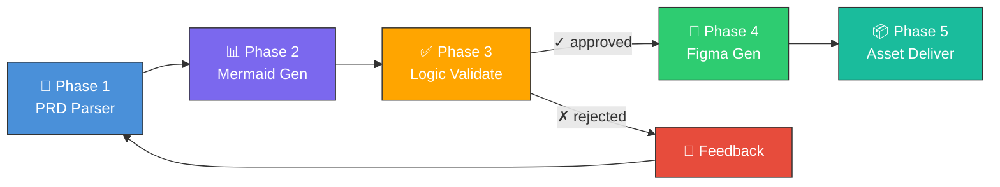

## What is Omni Architect?

Omni Architect is an **orchestration skill** that transforms Product Requirements Documents (PRDs) into validated design assets through an intelligent, multi-phase pipeline. It bridges the critical gap between product specification and visual design by inserting a logical validation layer.

## The Problem It Solves

In product teams, there's a significant gap between writing a PRD and materializing the visual design:

- **Rework**: designers misinterpret requirements
- **Inconsistencies**: product logic isn't validated before design
- **Slowness**: PRD → Design cycle takes days or weeks

<Warning>
Without logical validation, teams often discover fundamental product logic issues **after** investing time in visual design, leading to costly rework.
</Warning>

## The Solution

Omni Architect eliminates this gap by automating the pipeline and inserting a logical validation stage (via Mermaid diagrams) before visual generation (via Figma):

```
📄 PRD → 📊 Mermaid Diagrams → ✅ Validation → 🎨 Figma Assets
```

<Info>
**Result**: 70%+ reduction in design rework and guaranteed logical validation before investing in visual assets.
</Info>

## Core Architecture Principles

### 1. Sequential Pipeline with Feedback Loops

The architecture follows a linear pipeline where each phase builds on the previous one. If validation fails, the system can loop back to earlier phases for refinement.

### 2. Mermaid as Intermediate Representation

Mermaid diagrams serve as the bridge between text-based requirements and visual design:

- **Text-based**: Version-controllable, diffable, easily editable
- **Widely supported**: Renders in GitHub, documentation tools, IDEs
- **Logical validation**: Enables coherence checking before design investment

<Accordion title="Why Mermaid? (ADR-002)">
**Decision**: Use Mermaid as the intermediate representation between PRD and Figma.

**Motivation**: Mermaid is text-based (versionable), widely supported, and renderable without external tools. It allows logical validation before design investment.

**Consequence**: Some visual limitations of Mermaid don't translate 1:1 to Figma, but the logical validation benefits outweigh this.
</Accordion>

### 3. Weighted Validation Scoring

Quality is measured through a weighted scoring system across six criteria, allowing teams to calibrate what "valid" means for their project.

### 4. Sub-Skill Orchestration

Omni Architect is a **meta-skill** that orchestrates five specialized sub-skills, each responsible for one phase of the pipeline. This modular design enables:

- Independent testing and development
- Skill reusability in other contexts
- Clear separation of concerns

## High-Level Flow



## Data Flow

Each phase consumes outputs from the previous phase and produces structured artifacts:

| Phase | Input | Output | Purpose |
|-------|-------|--------|----------|
| **1. PRD Parser** | Raw Markdown PRD | Semantic structure (features, stories, entities) | Extract machine-readable structure |
| **2. Mermaid Generator** | Parsed PRD structure | Mermaid diagram code | Visualize product logic |
| **3. Logic Validator** | Diagrams + PRD | Validation report + coherence score | Quality gate before design |
| **4. Figma Generator** | Validated diagrams | Figma node IDs + preview URLs | Generate visual design assets |
| **5. Asset Delivery** | All artifacts | Consolidated package + handoff docs | Package deliverables for developers |

## Key Design Decisions

### Sequential Pipeline with Validation Gate (ADR-001)

<Accordion title="View Decision Record">
**Decision**: Linear pipeline with the ability to return to Phase 2 after rejection.

**Motivation**: Ensures no Figma asset is generated without prior logic validation.

**Consequence**: May increase total time, but drastically reduces rework.
</Accordion>

### Weighted Coherence Score (ADR-003)

<Accordion title="View Decision Record">
**Decision**: Use a weighted score with 6 criteria for validation.

**Motivation**: Allows fine-tuning of what is considered "valid" per project.

**Consequence**: Requires initial threshold tuning per team/project.
</Accordion>

## Orchestration Dependencies

Omni Architect orchestrates these specialized skills:

- **prd-generator** — PRD parsing and structuring
- **mermaid-diagrams** — Mermaid diagram generation
- **figma** — Figma API integration
- **frontend-design** — Production-grade frontend design
- **implement-design** — Pixel-perfect Figma implementation

<Note>
All sub-skills can be used independently outside of Omni Architect, making them reusable building blocks.
</Note>

## Configuration Flexibility

The architecture supports multiple configuration modes:

- **Validation modes**: `interactive`, `batch`, `auto`
- **Design systems**: `material-3`, `apple-hig`, `tailwind`, `custom`
- **Diagram types**: `flowchart`, `sequence`, `erDiagram`, `stateDiagram`, `C4Context`, `journey`, `gantt`
- **Locales**: Multi-language support for labels and documentation

## Next Steps

<CardGroup cols={2}>
  <Card title="Pipeline Architecture" icon="diagram-project" href="/concepts/pipeline-architecture">
    Deep dive into the 5-phase pipeline
  </Card>
  <Card title="Skills System" icon="puzzle-piece" href="/concepts/skills-system">
    Learn about sub-skill orchestration
  </Card>
  <Card title="Validation Scoring" icon="check-circle" href="/concepts/validation-scoring">
    Understand the 6-criteria validation system
  </Card>
  <Card title="Quick Start" icon="rocket" href="/quickstart">
    Get started with Omni Architect
  </Card>
</CardGroup>