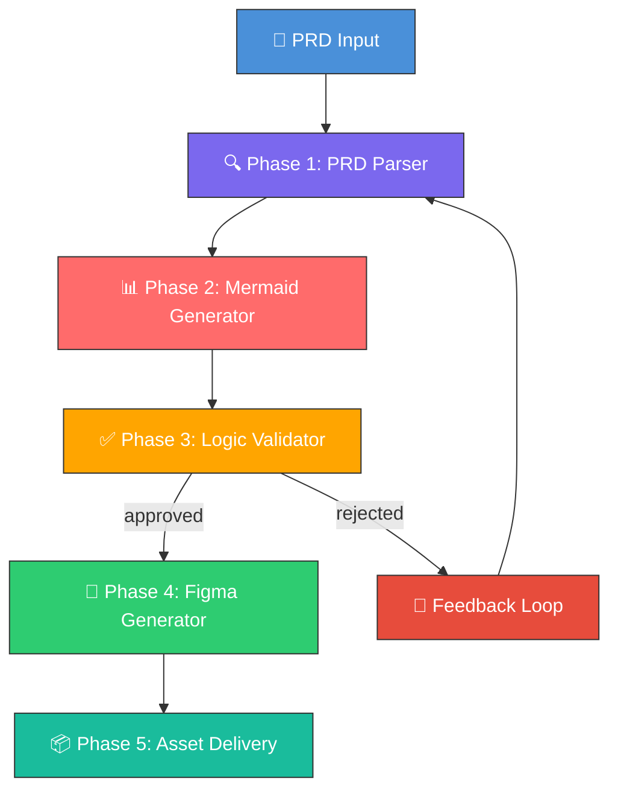
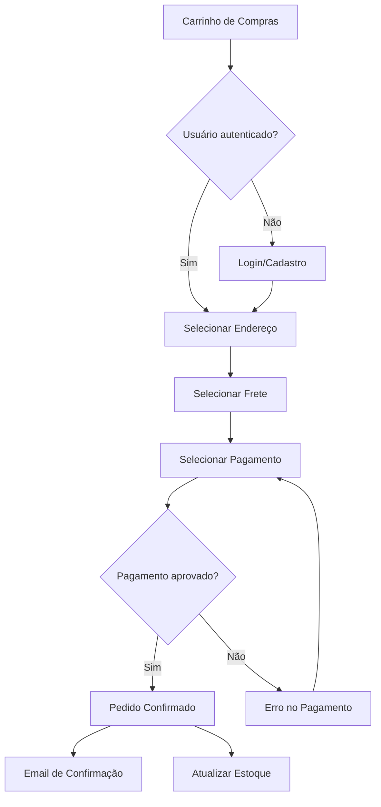
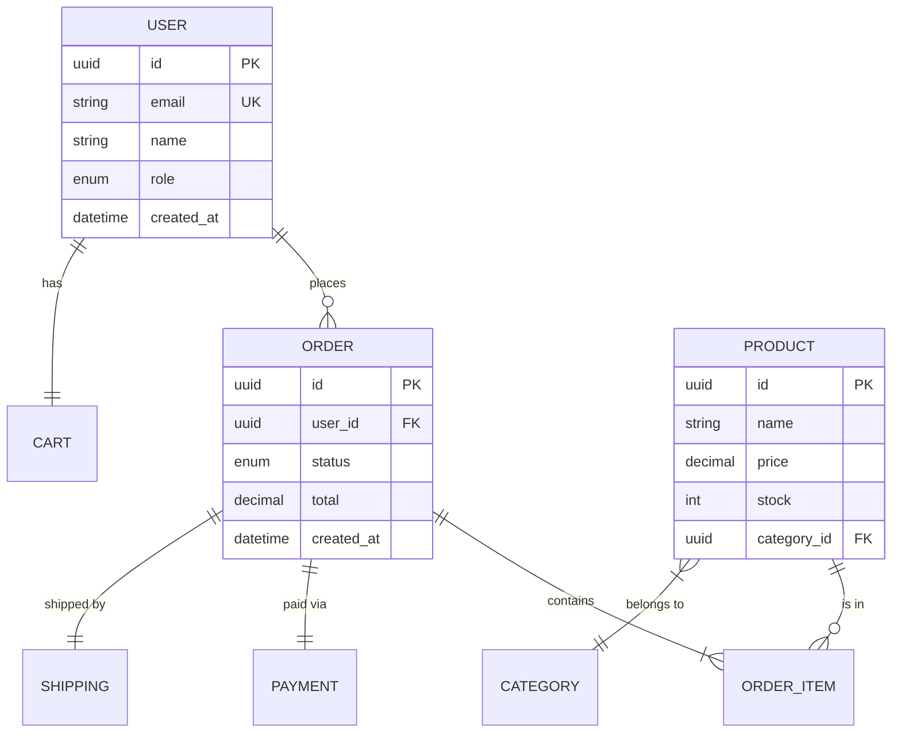
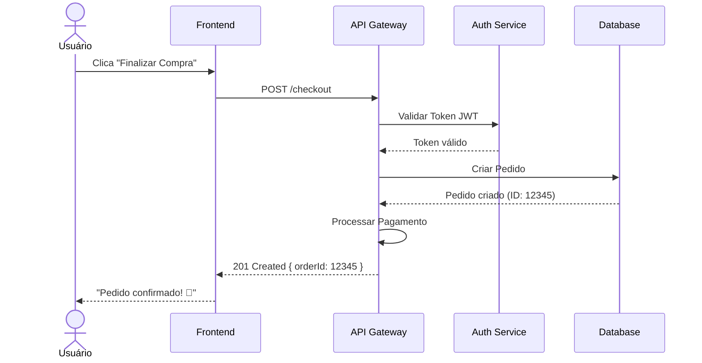

## Overview

Omni Architect implements a **sequential 5-phase pipeline** with built-in feedback loops. Each phase is executed by a specialized sub-skill, producing structured outputs that feed into the next phase.



## Phase 1: PRD Parser

**Skill**: `prd-parse`  
**Purpose**: Extract semantic structure from Markdown PRD

### What It Extracts

| Element | Description |
|---------|-------------|
| `features` | List of functionalities with priority and complexity |
| `user_stories` | User stories in "As X, I want Y, so that Z" format |
| `entities` | Domain entities and their attributes |
| `flows` | Business flows and their steps |
| `requirements` | Functional and non-functional requirements |
| `acceptance_criteria` | Acceptance criteria per feature |
| `dependencies` | Dependencies between features |
| `personas` | Identified user personas |

### Parsing Algorithm

```
1. Tokenize PRD into sections by heading level (H1, H2, H3)
2. Classify each section by semantic type (feature, story, requirement, etc.)
3. Extract named entities (NER) to identify domain
4. Map relationships between entities
5. Calculate dependency graph between features
6. Generate PRD completeness score (0.0 - 1.0)
7. If score < 0.6, emit warnings with improvement suggestions
```

### Classification Heuristics

The parser uses pattern matching to classify sections:

| Pattern in Text | Classification |
|----------------|----------------|
| "Como [persona], quero..." / "As [persona], I want..." | User Story |
| "Requisito:", "Deve..." / "Requirement:", "Must..." | Functional Requirement |
| "Performance:", "Segurança:" / "Security:", "Performance:" | Non-Functional Requirement |
| Tables with attributes | Domain Entity |
| "Fluxo:", numbered step lists / "Flow:", numbered lists | Business Flow |
| "Critério de aceite", checkboxes / "Acceptance criteria" | Acceptance Criteria |

<Accordion title="Example Output: Parsed PRD">
```json
{
  "project": "E-Commerce Platform",
  "completeness_score": 0.87,
  "features": [
    {
      "id": "F001",
      "name": "User Authentication",
      "priority": "high",
      "complexity": "medium",
      "stories": ["US001", "US002"],
      "dependencies": []
    },
    {
      "id": "F002",
      "name": "Product Catalog",
      "priority": "high",
      "complexity": "high",
      "stories": ["US003", "US004", "US005"],
      "dependencies": ["F001"]
    }
  ],
  "entities": [
    {
      "name": "User",
      "attributes": ["id", "email", "name", "role", "created_at"],
      "relationships": [
        { "target": "Order", "type": "one-to-many" },
        { "target": "Cart", "type": "one-to-one" }
      ]
    }
  ]
}
```
</Accordion>

<Warning>
If the PRD completeness score is below 0.6, the pipeline continues but emits warnings. Low scores typically indicate missing user stories, undefined entities, or incomplete flows.
</Warning>

---

## Phase 2: Mermaid Generator

**Skill**: `mermaid-gen`  
**Purpose**: Generate Mermaid diagrams from parsed PRD structure

### PRD to Diagram Mapping

| PRD Element | Mermaid Type | Purpose |
|-------------|--------------|----------|
| `flows` | `flowchart TD` | Visualize business flows |
| `user_stories` | `sequenceDiagram` | Show actor-system interactions |
| `entities` | `erDiagram` | Model data and relationships |
| `features.states` | `stateDiagram-v2` | State machines per feature |
| `system_overview` | `C4Context` | High-level architectural view |
| `personas + journeys` | `journey` | User journey maps |
| `dependencies + timeline` | `gantt` | Roadmap and temporal dependencies |

### Generation Rules

```
For each requested diagram type in diagram_types:
  1. Select relevant elements from parsed PRD
  2. Apply corresponding Mermaid template
  3. Resolve cross-references between entities
  4. Add labels in configured locale
  5. Validate Mermaid syntax (parser check)
  6. Calculate coherence score with original PRD
  7. Attach metadata (source_features, coverage_percentage)
```

### Example: Flowchart Generation

From a checkout flow in the PRD, the generator produces:

<Accordion title="Generated Flowchart">

</Accordion>

### Example: ER Diagram Generation

<Accordion title="Generated ER Diagram">

</Accordion>

### Example: Sequence Diagram Generation

<Accordion title="Generated Sequence Diagram">

</Accordion>

<Info>
**Automatic splitting**: If a diagram would exceed 50 nodes, it's automatically split into sub-diagrams with an index diagram linking them together.
</Info>

---

## Phase 3: Logic Validator

**Skill**: `logic-validate`  
**Purpose**: Validate diagram coherence against the original PRD

This phase implements a sophisticated validation engine that analyzes diagrams against six weighted criteria. See [Validation Scoring](/concepts/validation-scoring) for complete details.

### Validation Modes

| Mode | Behavior |
|------|----------|
| `interactive` | Present each diagram with its score, await user approval/rejection/modification |
| `batch` | Present all diagrams with consolidated report, await bulk decision |
| `auto` | Auto-approve if `score >= validation_threshold`, otherwise reject |

### Validation Flow

```
score_final = Σ (score_criterion × weight_criterion) for each criterion

If validation_mode == "auto":
    If score_final >= validation_threshold: APPROVED
    Else: REJECTED + generate feedback

If validation_mode == "interactive":
    Present each diagram + score to user
    Await input: approve / reject / modify
    If modify: return to Phase 2 with feedback

If validation_mode == "batch":
    Present all diagrams + consolidated report
    Await input: approve_all / reject_all / select
```

<Accordion title="Example Validation Report">
```json
{
  "overall_score": 0.91,
  "status": "approved",
  "breakdown": {
    "coverage": { "score": 0.95, "details": "19/20 features covered" },
    "consistency": { "score": 0.88, "details": "Entity 'Payment' differs between ER and Sequence" },
    "completeness": { "score": 0.90, "details": "Missing sad path in 'Password Recovery'" },
    "traceability": { "score": 0.93, "details": "All traceable except US018" },
    "naming_coherence": { "score": 0.92, "details": "'Usuário' vs 'User' inconsistent" },
    "dependency_integrity": { "score": 0.98, "details": "All dependencies respected" }
  },
  "warnings": [
    "Entity 'Payment' uses different attributes in ER vs Sequence diagram",
    "User story US018 has no visual representation"
  ],
  "suggestions": [
    "Standardize nomenclature to 'User' across all diagrams",
    "Add error flow to 'Password Recovery'",
    "Map US018 to authentication flowchart"
  ]
}
```
</Accordion>

---

## Phase 4: Figma Generator

**Skill**: `figma-gen`  
**Purpose**: Generate design assets in Figma from validated diagrams

### Diagram to Figma Asset Mapping

| Mermaid Diagram | Figma Asset | Description |
|-----------------|-------------|-------------|
| `flowchart` | User Flow Page | Wireframe flows with connected screens |
| `sequenceDiagram` | Interaction Spec Component | Interaction specifications per screen |
| `erDiagram` | Data Model Documentation | Visual data model documentation |
| `stateDiagram` | State Management Component | UI states per component |
| `C4Context` | Architecture Overview Page | Stylized architectural diagram |
| `journey` | User Journey Map Frame | Visual user journey map |

### Generation Process

```
1. Connect to Figma API using figma_access_token
2. Create/identify page in file (figma_file_key)
3. For each validated diagram:
   a. Determine base design_system (Material 3, Apple HIG, etc.)
   b. Create main Frame with auto-layout
   c. Map diagram nodes → Figma components
   d. Apply design tokens (colors, typography, spacing)
   e. Create visual connections between components (arrows, lines)
   f. Generate responsive variants (mobile, tablet, desktop) if applicable
   g. Add development annotations
   h. Record node_id and preview_url in output
4. Create index page with links to all frames
5. Generate component library with reusable tokens
```

### Generated Figma Structure

```
📁 {project_name} - Omni Architect
├── 📄 Index (Navigation Page)
├── 📄 User Flows
│   ├── 🖼️ Flow: Checkout
│   ├── 🖼️ Flow: Authentication
│   └── 🖼️ Flow: Product Search
├── 📄 Interaction Specs
│   ├── 🖼️ Sequence: Checkout Process
│   └── 🖼️ Sequence: User Registration
├── 📄 Data Model
│   └── 🖼️ ER: Domain Model
├── 📄 Architecture
│   └── 🖼️ C4: System Context
├── 📄 User Journeys
│   ├── 🖼️ Journey: New User Onboarding
│   └── 🖼️ Journey: Returning Customer
└── 📄 Component Library
    ├── 🧩 Design Tokens
    ├── 🧩 Flow Connectors
    └── 🧩 Annotation Components
```

<Note>
**Rate limiting**: The generator implements exponential backoff (1s, 2s, 4s, 8s) with a maximum of 5 retries to handle Figma API rate limits gracefully.
</Note>

---

## Phase 5: Asset Delivery

**Skill**: `asset-deliver`  
**Purpose**: Consolidate all outputs into a structured delivery package

### Deliverables

| Artifact | Format | Description |
|----------|--------|-------------|
| PRD Parseado | JSON | Semantic structure extracted from PRD |
| Diagramas Mermaid | .mmd + SVG/PNG | Source code + rendered diagrams |
| Relatório de Validação | JSON + Markdown | Validation score and details |
| Figma Assets | Figma Nodes | Direct links to Figma frames |
| Orchestration Log | JSON | Complete log with metrics and timeline |
| Design Handoff Doc | Markdown | Handoff documentation for developers |

### Output Structure

```
output/
├── parsed-prd.json
├── diagrams/
│   ├── flowchart-checkout.mmd
│   ├── flowchart-checkout.svg
│   ├── sequence-auth.mmd
│   ├── sequence-auth.svg
│   ├── er-domain.mmd
│   └── er-domain.svg
├── validation/
│   ├── report.json
│   └── report.md
├── figma-assets.json
├── orchestration-log.json
└── HANDOFF.md
```

<Warning>
**Security**: Tokens and secrets are automatically removed from the orchestration log. Sensitive information is replaced with `[REDACTED]`.
</Warning>

---

## Error Handling & Edge Cases

| Scenario | Behavior |
|----------|----------|
| PRD incomplete (score < 0.6) | Emit warnings + suggestions, continue with available data |
| PRD without user stories | Generate only ER and C4, skip sequence diagrams |
| Invalid Mermaid syntax | Auto-retry with correction (max 3 attempts) |
| Figma API rate limit | Exponential backoff (1s, 2s, 4s, 8s) with max 5 retries |
| Expired Figma token | Clear error with token renewal instructions |
| Validation rejected (interactive) | Capture user feedback and regenerate specific diagram |
| Ambiguous entities in PRD | List ambiguities in validation_report.warnings |
| Diagram too complex (>100 nodes) | Auto-split into sub-diagrams with index diagram |
| Network timeout | Retry with progressive timeout, save state for resumption |
| PRD in different language than locale | Auto-detect language and translate labels per locale config |

---

## Next Steps

<CardGroup cols={2}>
  <Card title="Skills System" icon="puzzle-piece" href="/concepts/skills-system">
    Learn how sub-skills are orchestrated
  </Card>
  <Card title="Validation Scoring" icon="check-circle" href="/concepts/validation-scoring">
    Deep dive into the 6-criteria validation system
  </Card>
  <Card title="Configuration" icon="gear" href="/configuration/overview">
    Configure the pipeline for your project
  </Card>
  <Card title="Skills Reference" icon="code" href="/skills/prd-parse">
    Complete skills API documentation
  </Card>
</CardGroup>