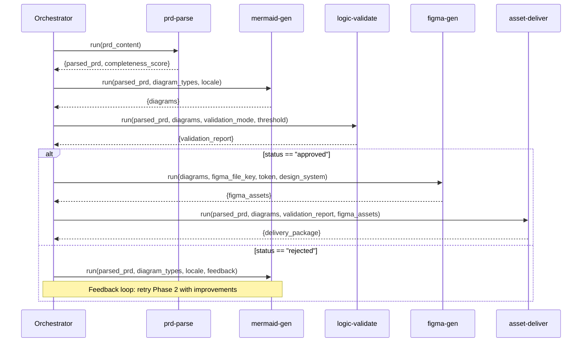

## Overview

Omni Architect is a **meta-skill** (orchestration skill) that coordinates five specialized sub-skills. Each sub-skill is independently executable but designed to work together in a cohesive pipeline.

<Info>
This modular architecture allows individual sub-skills to be used standalone in other contexts, tested independently, and developed by different teams.
</Info>

## The Five Sub-Skills

### 1. PRD Parser (`prd-parse`)

**Version**: 1.0.0  
**Author**: fabioeloi  
**Phase**: 1

#### Purpose
Extracts semantic structure from Markdown PRDs, identifying features, user stories, domain entities, business flows, and acceptance criteria.

#### Inputs

| Parameter | Type | Required | Description |
|-----------|------|----------|-------------|
| `prd_content` | string | Yes | Complete PRD content in Markdown |

#### Outputs

| Output | Type | Description |
|--------|------|-------------|
| `parsed_prd` | object | Semantic structure with features, stories, entities, flows |
| `completeness_score` | number | PRD completeness score (0.0 - 1.0) |

#### Key Features

- Tokenization by heading levels (H1, H2, H3)
- Semantic classification (feature, story, requirement, entity, flow)
- Named Entity Recognition (NER) for domain identification
- Relationship mapping between entities
- Dependency graph calculation between features
- Completeness scoring with warnings if score < 0.6

<Accordion title="Standalone Usage Example">
```javascript
const prdParse = require('prd-parse');

const result = await prdParse.run({
  prd_content: fs.readFileSync('./my-prd.md', 'utf-8')
});

console.log(`Completeness: ${result.completeness_score}`);
console.log(`Features found: ${result.parsed_prd.features.length}`);
console.log(`Entities found: ${result.parsed_prd.entities.length}`);
```
</Accordion>

---

### 2. Mermaid Generator (`mermaid-gen`)

**Version**: 1.0.0  
**Author**: fabioeloi  
**Phase**: 2

#### Purpose
Generates Mermaid diagrams automatically from parsed PRD structure. Supports flowchart, sequence, ER, state, C4, journey, and gantt diagrams.

#### Inputs

| Parameter | Type | Required | Default | Description |
|-----------|------|----------|---------|-------------|
| `parsed_prd` | object | Yes | - | Output from prd-parse |
| `diagram_types` | array | No | `["flowchart", "sequence", "erDiagram"]` | Diagram types to generate |
| `locale` | string | No | `"pt-BR"` | Language for labels |

#### Outputs

| Output | Type | Description |
|--------|------|-------------|
| `diagrams` | array | Array of objects with `{type, code, coverage_pct, source_features}` |

#### Key Features

- Smart PRD element → diagram type mapping
- Syntax validation before emission (parser check)
- Multi-language label support
- Automatic diagram splitting if >50 nodes
- Feature/story ID references in Mermaid comments
- Coverage percentage calculation

#### Diagram Type Mapping

| PRD Element | Mermaid Type | Condition |
|-------------|--------------|----------|
| `flows` | `flowchart TD` | When flows exist |
| `user_stories` + `entities` | `sequenceDiagram` | When actor-system interactions present |
| `entities` + `relationships` | `erDiagram` | When ≥2 entities exist |
| `features` with states | `stateDiagram-v2` | When features have lifecycle states |
| `system_overview` | `C4Context` | When external systems mentioned |
| `personas` + `journeys` | `journey` | When personas defined |

<Accordion title="Standalone Usage Example">
```javascript
const mermaidGen = require('mermaid-gen');

const result = await mermaidGen.run({
  parsed_prd: parsedPrdObject,
  diagram_types: ['flowchart', 'sequence', 'erDiagram', 'stateDiagram'],
  locale: 'en-US'
});

result.diagrams.forEach(diagram => {
  console.log(`${diagram.type}: ${diagram.coverage_pct}% coverage`);
  fs.writeFileSync(`${diagram.type}.mmd`, diagram.code);
});
```
</Accordion>

---

### 3. Logic Validator (`logic-validate`)

**Version**: 1.0.0  
**Author**: fabioeloi  
**Phase**: 3

#### Purpose
Validates diagram coherence against the original PRD using a weighted 6-criteria scoring system. Generates detailed validation reports.

#### Inputs

| Parameter | Type | Required | Default | Description |
|-----------|------|----------|---------|-------------|
| `parsed_prd` | object | Yes | - | Output from prd-parse |
| `diagrams` | array | Yes | - | Output from mermaid-gen |
| `validation_mode` | string | No | `"interactive"` | `interactive`, `batch`, or `auto` |
| `validation_threshold` | number | No | `0.85` | Minimum score for auto-approval (0.0-1.0) |

#### Outputs

| Output | Type | Description |
|--------|------|-------------|
| `validation_report` | object | Report with score, status, breakdown, warnings, suggestions |

#### Validation Criteria

See [Validation Scoring](/concepts/validation-scoring) for complete details on the 6-criteria system.

#### Validation Modes

- **interactive**: Present each diagram with score, await user decision per diagram
- **batch**: Present all diagrams with consolidated report, await bulk decision
- **auto**: Auto-approve if `score >= validation_threshold`, reject otherwise

<Accordion title="Standalone Usage Example">
```javascript
const logicValidate = require('logic-validate');

const result = await logicValidate.run({
  parsed_prd: parsedPrdObject,
  diagrams: diagramsArray,
  validation_mode: 'auto',
  validation_threshold: 0.85
});

if (result.validation_report.status === 'approved') {
  console.log(`Validation passed with score: ${result.validation_report.overall_score}`);
} else {
  console.log('Validation failed. Suggestions:');
  result.validation_report.suggestions.forEach(s => console.log(`- ${s}`));
}
```
</Accordion>

---

### 4. Figma Generator (`figma-gen`)

**Version**: 1.0.0  
**Author**: fabioeloi  
**Phase**: 4

#### Purpose
Generates design assets in Figma from validated Mermaid diagrams. Creates organized frames, components, and flows mapped to diagram types.

#### Inputs

| Parameter | Type | Required | Default | Description |
|-----------|------|----------|---------|-------------|
| `diagrams` | array | Yes | - | Validated diagrams (status=approved) |
| `figma_file_key` | string | Yes | - | Figma file key from URL |
| `figma_access_token` | string | Yes | - | Figma API access token |
| `design_system` | string | No | `"material-3"` | `material-3`, `apple-hig`, `tailwind`, `custom` |
| `project_name` | string | Yes | - | Project name for Figma organization |

#### Outputs

| Output | Type | Description |
|--------|------|-------------|
| `figma_assets` | array | Array of `{node_id, type, name, preview_url, figma_url}` |

#### Key Features

- Figma REST API v1 integration
- Auto-layout frame creation
- Design token application (colors, typography, spacing)
- Responsive variant generation (mobile, tablet, desktop)
- Development annotation embedding
- Component library generation
- Rate limiting with exponential backoff
- Component caching to minimize API calls

<Accordion title="Standalone Usage Example">
```javascript
const figmaGen = require('figma-gen');

const result = await figmaGen.run({
  diagrams: validatedDiagrams,
  figma_file_key: 'abc123XYZ',
  figma_access_token: process.env.FIGMA_TOKEN,
  design_system: 'material-3',
  project_name: 'My SaaS App'
});

result.figma_assets.forEach(asset => {
  console.log(`${asset.type}: ${asset.figma_url}`);
});
```
</Accordion>

---

### 5. Asset Delivery (`asset-deliver`)

**Version**: 1.0.0  
**Author**: fabioeloi  
**Phase**: 5

#### Purpose
Consolidates all pipeline outputs into a structured delivery package with handoff documentation and orchestration logs.

#### Inputs

| Parameter | Type | Required | Description |
|-----------|------|----------|-------------|
| `parsed_prd` | object | Yes | Output from prd-parse |
| `diagrams` | array | Yes | Output from mermaid-gen |
| `validation_report` | object | Yes | Output from logic-validate |
| `figma_assets` | array | Yes | Output from figma-gen |

#### Outputs

| Output | Type | Description |
|--------|------|-------------|
| `delivery_package` | object | Complete package with all artifacts, logs, and handoff docs |

#### Generated Artifacts

| Artifact | Format | Location |
|----------|--------|-----------|
| PRD Parseado | JSON | `output/parsed-prd.json` |
| Diagramas Mermaid | .mmd + .svg | `output/diagrams/` |
| Relatório de Validação | JSON + MD | `output/validation/` |
| Figma Assets (links) | JSON | `output/figma-assets.json` |
| Orchestration Log | JSON | `output/orchestration-log.json` |
| Design Handoff Doc | Markdown | `output/HANDOFF.md` |

#### Key Features

- Token and secret sanitization in logs
- Sensitive information redaction (`[REDACTED]`)
- Complete orchestration timeline
- Developer handoff documentation generation
- Metrics aggregation (timing, quality scores, coverage)

<Accordion title="Standalone Usage Example">
```javascript
const assetDeliver = require('asset-deliver');

const result = await assetDeliver.run({
  parsed_prd: parsedPrdObject,
  diagrams: diagramsArray,
  validation_report: validationReportObject,
  figma_assets: figmaAssetsArray
});

console.log('Delivery package created:');
console.log(`- Diagrams: ${result.delivery_package.diagrams_count}`);
console.log(`- Figma assets: ${result.delivery_package.figma_assets_count}`);
console.log(`- Package location: ${result.delivery_package.output_path}`);
```
</Accordion>

---

## Orchestration Flow

The orchestration layer in Omni Architect handles:

1. **Sequential execution** of sub-skills in order
2. **Data passing** between phases via structured outputs
3. **Error handling** and retry logic per phase
4. **Feedback loops** when validation fails
5. **State management** for resumable execution
6. **Logging and metrics** across all phases



## Dependency Management

Omni Architect orchestrates external skills from the skills ecosystem:

| External Skill | Source | Usage |
|----------------|--------|-------|
| `mermaid-diagrams` | [softaworks/agent-toolkit](https://skills.sh/softaworks/agent-toolkit/mermaid-diagrams) | Mermaid rendering validation |
| `figma` | [hoodini/ai-agents-skills](https://skills.sh/hoodini/ai-agents-skills/figma) | Figma API integration |
| `prd-generator` | [jamesrochabrun/skills](https://skills.sh/jamesrochabrun/skills/prd-generator) | PRD parsing patterns |
| `frontend-design` | [anthropics/skills](https://skills.sh/anthropics/skills/frontend-design) | Production-grade design generation |
| `implement-design` | [figma/mcp-server-guide](https://skills.sh/figma/mcp-server-guide/implement-design) | Pixel-perfect Figma implementation |

<Note>
All dependency skills are automatically installed when you install Omni Architect, or can be installed individually for standalone use.
</Note>

## Benefits of Modular Architecture

### Reusability
Each sub-skill can be used independently in other workflows:
- Use `prd-parse` alone to analyze PRD quality
- Use `mermaid-gen` to generate diagrams from any structured data
- Use `logic-validate` to validate any Mermaid diagrams
- Use `figma-gen` to generate Figma assets from any diagram source

### Testability
Each sub-skill can be unit tested in isolation with mock inputs, enabling:
- Faster test execution
- Easier debugging
- Clear failure attribution

### Independent Development
Teams can work on different sub-skills simultaneously without conflicts.

### Flexibility
Replace or extend individual sub-skills without affecting the entire pipeline:
- Swap `figma-gen` for a `sketch-gen` implementation
- Add a new validation criterion to `logic-validate`
- Extend `mermaid-gen` to support new diagram types

## Configuration Inheritance

Sub-skills inherit configuration from the parent orchestrator but can be overridden:

```yaml
# .omni-architect.yml
locale: "pt-BR"
validation_threshold: 0.85

# Override for specific sub-skill
skills:
  mermaid-gen:
    locale: "en-US"  # Override parent locale
  logic-validate:
    validation_threshold: 0.90  # Stricter threshold
```

---

## Next Steps

<CardGroup cols={2}>
  <Card title="Pipeline Architecture" icon="diagram-project" href="/concepts/pipeline-architecture">
    See how sub-skills work together in the pipeline
  </Card>
  <Card title="Validation Scoring" icon="check-circle" href="/concepts/validation-scoring">
    Understand the validation criteria
  </Card>
  <Card title="API Reference" icon="code" href="/skills/prd-parse">
    Complete API docs for all sub-skills
  </Card>
  <Card title="Extending Omni Architect" icon="puzzle-piece" href="/concepts/skills-system">
    Learn how to create custom sub-skills
  </Card>
</CardGroup>