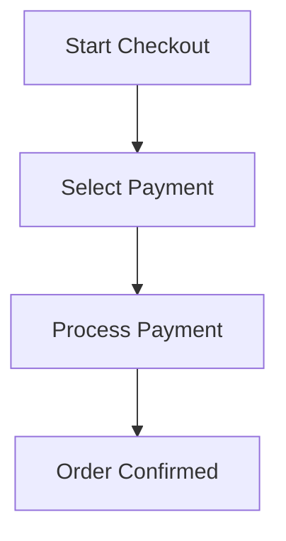
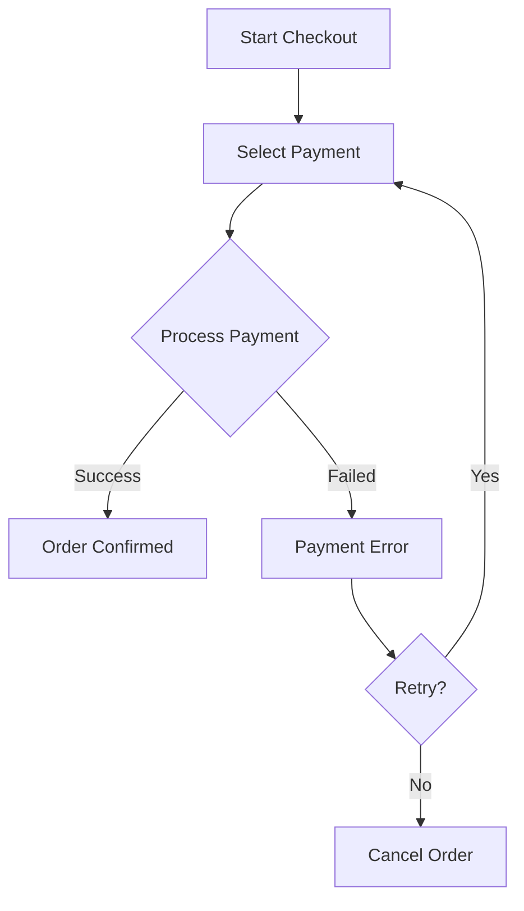
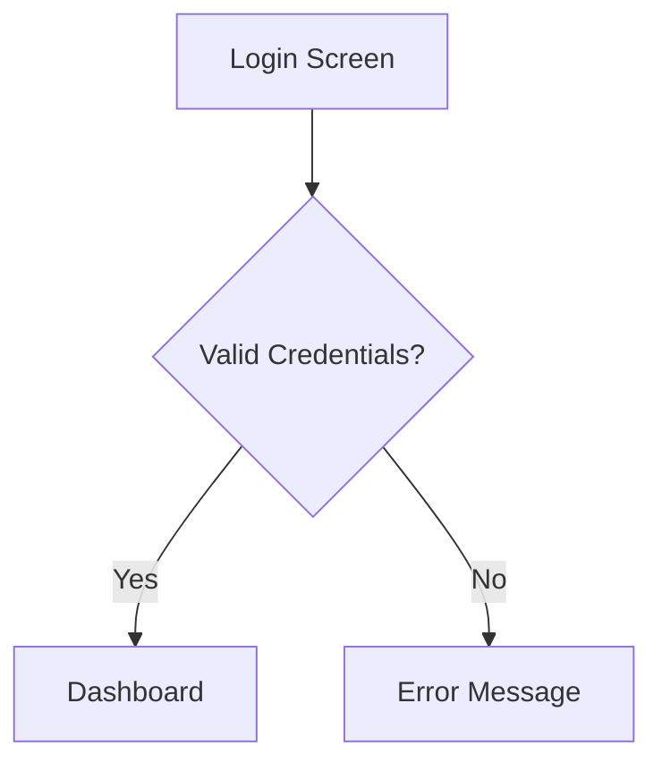
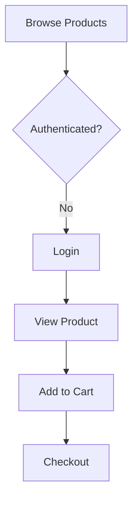

## Overview

The Logic Validator (`logic-validate`) analyzes diagram coherence using a **weighted 6-criteria scoring system**. This system ensures that generated Mermaid diagrams accurately represent the product logic defined in the original PRD before any design work begins.

<Info>
The validation system acts as a **quality gate** between logical representation (Mermaid) and visual design (Figma), preventing costly rework from logic errors discovered late in the design process.
</Info>

## The Six Validation Criteria

Each criterion evaluates a different aspect of diagram quality. Scores are calculated on a scale of 0.0 to 1.0, then multiplied by their respective weights.

### Criteria Summary Table

| Criterion | Weight | Purpose | What It Measures |
|-----------|--------|---------|------------------|
| **Coverage** | 0.25 | Completeness | % of PRD features/stories represented in diagrams |
| **Consistency** | 0.25 | Data integrity | Same entities have same attributes across all diagrams |
| **Completeness** | 0.20 | Flow coverage | Both happy path and sad path scenarios represented |
| **Traceability** | 0.15 | Requirement mapping | Every diagram node maps to a PRD requirement ID |
| **Naming Coherence** | 0.10 | Terminology | Consistent nomenclature without conflicting aliases |
| **Dependency Integrity** | 0.05 | Flow logic | Feature dependencies respected in flow order |

<Note>
Weights total to 1.0 (100%). These default weights can be customized per project in the configuration file.
</Note>

---

## 1. Coverage (Weight: 0.25)

### What It Measures
Percentage of features and user stories from the PRD that are represented in at least one diagram.

### Calculation

```
coverage_score = (features_in_diagrams / total_features) × 0.5 +
                 (stories_in_diagrams / total_stories) × 0.5
```

### Example

<Accordion title="Coverage Calculation Example">
Given:
- Total PRD features: 20
- Features represented in diagrams: 19
- Total user stories: 30
- Stories represented in diagrams: 28

Calculation:
```
feature_coverage = 19 / 20 = 0.95
story_coverage = 28 / 30 = 0.933
coverage_score = (0.95 × 0.5) + (0.933 × 0.5) = 0.941
```

Weighted contribution:
```
coverage_contribution = 0.941 × 0.25 = 0.235
```
</Accordion>

### What Good Looks Like

✅ **Score ≥ 0.90**: Excellent coverage  
⚠️ **Score 0.70-0.89**: Acceptable but some features missing  
❌ **Score < 0.70**: Poor coverage, many features unrepresented

### Typical Issues

- Features mentioned in PRD but not visualized in any diagram
- User stories that don't map to sequence or flow diagrams
- Acceptance criteria without corresponding diagram elements

---

## 2. Consistency (Weight: 0.25)

### What It Measures
Whether the same entity appears with the same attributes and relationships across all diagrams.

### Validation Rules

- Entity names must match exactly (case-sensitive)
- Attributes must be consistent across ER diagrams, sequence diagrams, and flowcharts
- Relationships must not conflict (e.g., User → Order can't be both one-to-many and one-to-one)

### Calculation

```
For each entity appearing in multiple diagrams:
  If attributes match: +1
  If attributes differ: +0
  
consistency_score = matching_entities / total_cross_diagram_entities
```

### Example

<Accordion title="Consistency Check Example">
**Diagram 1 (ER Diagram)**:
```
USER {
    uuid id PK
    string email UK
    string name
    enum role
}
```

**Diagram 2 (Sequence Diagram)**:
```
participant User as User
Note over User: Has: id, email, name, role, created_at
```

**Issue**: `created_at` attribute exists in sequence diagram but missing from ER diagram.

**Score**: 0.80 (4 out of 5 attributes consistent)
</Accordion>

### What Good Looks Like

✅ **Score ≥ 0.95**: All entities consistent  
⚠️ **Score 0.85-0.94**: Minor inconsistencies  
❌ **Score < 0.85**: Significant entity conflicts

### Typical Issues

- Attribute differences between ER and sequence diagrams
- Relationship cardinality conflicts
- Same concept with different names (e.g., "User" vs "Customer")

---

## 3. Completeness (Weight: 0.20)

### What It Measures
Whether flowcharts and sequence diagrams include both **happy paths** (success scenarios) and **sad paths** (error/failure scenarios).

### Validation Rules

- Each user flow must have at least one error handling branch
- Authentication flows must show both successful login and failed login
- Payment flows must show both approval and rejection paths
- State diagrams must include error/failure states

### Calculation

```
For each flow/sequence diagram:
  If has_happy_path AND has_sad_path: flow_complete = 1
  Else: flow_complete = 0.5 (partial credit for happy path only)

completeness_score = average(flow_complete across all flows)
```

### Example

<Accordion title="Completeness Check Example">
**Incomplete Flow** (only happy path):


**Complete Flow** (happy + sad paths):


Score: Incomplete = 0.5, Complete = 1.0
</Accordion>

### What Good Looks Like

✅ **Score ≥ 0.90**: All flows include error handling  
⚠️ **Score 0.70-0.89**: Most flows complete, some missing sad paths  
❌ **Score < 0.70**: Many flows lack error scenarios

### Typical Issues

- Missing error states in flowcharts
- No retry logic in payment/authentication flows
- Absence of timeout/network error handling
- Missing validation failure paths

---

## 4. Traceability (Weight: 0.15)

### What It Measures
Whether every node in the Mermaid diagrams can be traced back to a specific requirement, feature, or user story ID in the PRD.

### Implementation

Mermaid diagrams include comments linking nodes to PRD IDs:



### Calculation

```
traceability_score = nodes_with_prd_reference / total_nodes
```

### Example

<Accordion title="Traceability Check Example">
Given a flowchart with 15 nodes:
- 14 nodes have PRD references (feature IDs or story IDs)
- 1 node has no reference

Calculation:
```
traceability_score = 14 / 15 = 0.933
```

Weighted contribution:
```
traceability_contribution = 0.933 × 0.15 = 0.140
```
</Accordion>

### What Good Looks Like

✅ **Score ≥ 0.95**: Nearly all nodes traceable  
⚠️ **Score 0.80-0.94**: Most nodes traceable, some orphaned  
❌ **Score < 0.80**: Many nodes lack PRD references

### Typical Issues

- Generic nodes without feature mapping (e.g., "Error" without context)
- Infrastructure nodes not linked to non-functional requirements
- Automatically generated connecting nodes without explicit PRD mapping

---

## 5. Naming Coherence (Weight: 0.10)

### What It Measures
Consistency of terminology across all diagrams. The same concept should use the same name everywhere.

### Validation Rules

- No conflicting aliases (e.g., "User" and "Customer" for same entity)
- Consistent language (don't mix "Usuário" and "User")
- Standardized abbreviations (e.g., always "ID" not "Id" or "id")
- Consistent verb tenses in process names

### Calculation

```
For each entity/concept:
  If used with same name across all diagrams: coherent = 1
  If has aliases: coherent = 0

naming_coherence_score = coherent_concepts / total_concepts
```

### Example

<Accordion title="Naming Coherence Check Example">
**Issue**: Inconsistent terminology

- ER Diagram uses: `USER`, `ORDER`, `PAYMENT`
- Flowchart uses: `User`, `Pedido`, `Payment`
- Sequence Diagram uses: `Customer`, `Order`, `Transaction`

Problems:
- "User" vs "Customer" (same concept, different names)
- "ORDER" vs "Order" vs "Pedido" (casing and language inconsistency)
- "PAYMENT" vs "Payment" vs "Transaction" (casing and terminology)

Score: 0/3 = 0.00 (all three concepts inconsistent)

After fixing to use consistent names:
- All diagrams use: `User`, `Order`, `Payment`

Score: 3/3 = 1.00
</Accordion>

### What Good Looks Like

✅ **Score ≥ 0.95**: Consistent terminology throughout  
⚠️ **Score 0.80-0.94**: Minor naming inconsistencies  
❌ **Score < 0.80**: Significant terminology conflicts

### Typical Issues

- Mixed languages (Portuguese and English)
- Inconsistent casing (PascalCase vs camelCase vs snake_case)
- Synonyms used interchangeably
- Abbreviated vs full names ("Auth" vs "Authentication")

---

## 6. Dependency Integrity (Weight: 0.05)

### What It Measures
Whether feature dependencies defined in the PRD are respected in the flow order of diagrams.

### Validation Rules

- If Feature B depends on Feature A, flows for B must reference or include A
- Sequence diagrams must show dependent services in correct order
- State transitions must respect prerequisite states
- Gantt diagrams must show dependencies as predecessor relationships

### Calculation

```
For each dependency in PRD:
  If dependency reflected in diagram flow: valid = 1
  Else: valid = 0

dependency_integrity_score = valid_dependencies / total_dependencies
```

### Example

<Accordion title="Dependency Integrity Check Example">
**PRD Dependencies**:
- F002 "Product Catalog" depends on F001 "User Authentication"
- F003 "Checkout" depends on F001 and F002

**Flowchart Analysis**:


Validation:
- ✅ Checkout (F003) comes after Authentication (F001) and Product browsing (F002)
- ✅ All dependencies respected in flow order

Score: 2/2 = 1.00
</Accordion>

### What Good Looks Like

✅ **Score ≥ 0.95**: All dependencies respected  
⚠️ **Score 0.85-0.94**: Minor dependency ordering issues  
❌ **Score < 0.85**: Dependencies violated in flows

### Typical Issues

- Features shown before their dependencies
- Circular dependencies not flagged
- Missing prerequisite checks in flows
- Gantt charts with incorrect dependency arrows

---

## Overall Score Calculation

The final validation score is the weighted sum of all criteria:

```
overall_score = 
  (coverage × 0.25) +
  (consistency × 0.25) +
  (completeness × 0.20) +
  (traceability × 0.15) +
  (naming_coherence × 0.10) +
  (dependency_integrity × 0.05)
```

### Complete Example

<Accordion title="Full Score Calculation">
Given:
- Coverage: 0.95
- Consistency: 0.88
- Completeness: 0.90
- Traceability: 0.93
- Naming Coherence: 0.92
- Dependency Integrity: 0.98

Calculation:
```
overall_score = 
  (0.95 × 0.25) +   // 0.2375
  (0.88 × 0.25) +   // 0.2200
  (0.90 × 0.20) +   // 0.1800
  (0.93 × 0.15) +   // 0.1395
  (0.92 × 0.10) +   // 0.0920
  (0.98 × 0.05)     // 0.0490
= 0.918
```

With default threshold of 0.85:
- ✅ **APPROVED** (0.918 ≥ 0.85)
</Accordion>

---

## Validation Modes

### Interactive Mode

```yaml
validation_mode: "interactive"
```

Presents each diagram individually with its score breakdown. User can:
- **Approve**: Continue to next diagram
- **Reject**: Return to Phase 2 with specific feedback
- **Modify**: Provide improvement suggestions and regenerate

**Best for**: First-time runs, complex PRDs, learning the system

### Batch Mode

```yaml
validation_mode: "batch"
```

Presents all diagrams with consolidated report. User can:
- **Approve All**: Continue to Figma generation
- **Reject All**: Return to Phase 2 with consolidated feedback
- **Select**: Cherry-pick which diagrams to approve/reject

**Best for**: Quick reviews, experienced teams, smaller PRDs

### Auto Mode

```yaml
validation_mode: "auto"
validation_threshold: 0.85
```

Automatically approves if `overall_score >= validation_threshold`, otherwise rejects with generated feedback.

**Best for**: CI/CD pipelines, regression testing, mature workflows

<Warning>
Auto mode requires careful threshold calibration. Start with interactive mode to understand typical scores for your PRD style before enabling auto.
</Warning>

---

## Customizing Validation Weights

You can customize criterion weights in the configuration file:

```yaml
# .omni-architect.yml
validation:
  mode: "auto"
  threshold: 0.85
  
  # Custom weights (must sum to 1.0)
  weights:
    coverage: 0.30           # Emphasize coverage more
    consistency: 0.25
    completeness: 0.20
    traceability: 0.15
    naming_coherence: 0.05   # De-emphasize naming
    dependency_integrity: 0.05
```

<Note>
Custom weights are useful when your team prioritizes certain aspects. For example, data-heavy applications might increase `consistency` weight, while flow-heavy apps might increase `completeness` weight.
</Note>

---

## Validation Report Structure

```json
{
  "overall_score": 0.91,
  "status": "approved",
  "threshold": 0.85,
  "breakdown": {
    "coverage": { 
      "score": 0.95, 
      "weight": 0.25,
      "contribution": 0.2375,
      "details": "19/20 features covered" 
    },
    "consistency": { 
      "score": 0.88, 
      "weight": 0.25,
      "contribution": 0.2200,
      "details": "Entity 'Payment' differs between ER and Sequence" 
    },
    "completeness": { 
      "score": 0.90, 
      "weight": 0.20,
      "contribution": 0.1800,
      "details": "Missing sad path in 'Password Recovery'" 
    },
    "traceability": { 
      "score": 0.93, 
      "weight": 0.15,
      "contribution": 0.1395,
      "details": "All traceable except US018" 
    },
    "naming_coherence": { 
      "score": 0.92, 
      "weight": 0.10,
      "contribution": 0.0920,
      "details": "'Usuário' vs 'User' inconsistent" 
    },
    "dependency_integrity": { 
      "score": 0.98, 
      "weight": 0.05,
      "contribution": 0.0490,
      "details": "All dependencies respected" 
    }
  },
  "warnings": [
    "Entity 'Payment' uses different attributes in ER vs Sequence diagram",
    "User story US018 has no visual representation"
  ],
  "suggestions": [
    "Standardize nomenclature to 'User' across all diagrams",
    "Add error flow to 'Password Recovery'",
    "Map US018 to authentication flowchart"
  ]
}
```

---

## Next Steps

<CardGroup cols={2}>
  <Card title="Pipeline Architecture" icon="diagram-project" href="/concepts/pipeline-architecture">
    See where validation fits in the pipeline
  </Card>
  <Card title="Configuration Guide" icon="gear" href="/configuration/overview">
    Configure validation thresholds and weights
  </Card>
  <Card title="Troubleshooting" icon="wrench" href="/guides/troubleshooting">
    Fix common validation issues
  </Card>
  <Card title="Best Practices" icon="star" href="/guides/writing-prds">
    Tips for passing validation
  </Card>
</CardGroup>