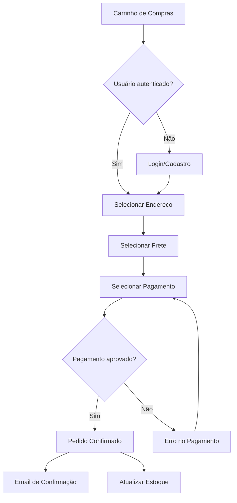
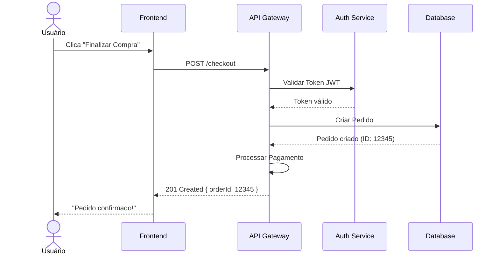
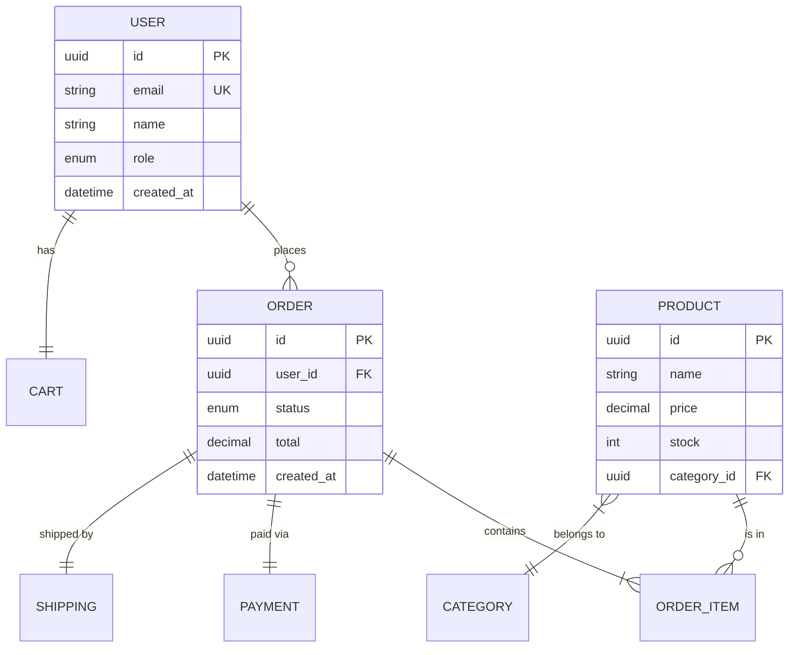
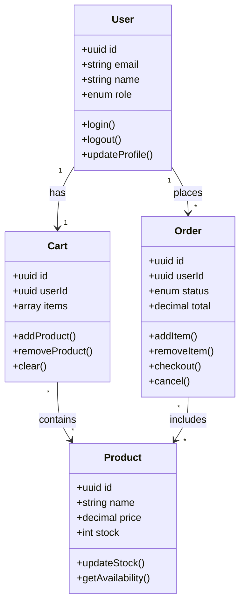
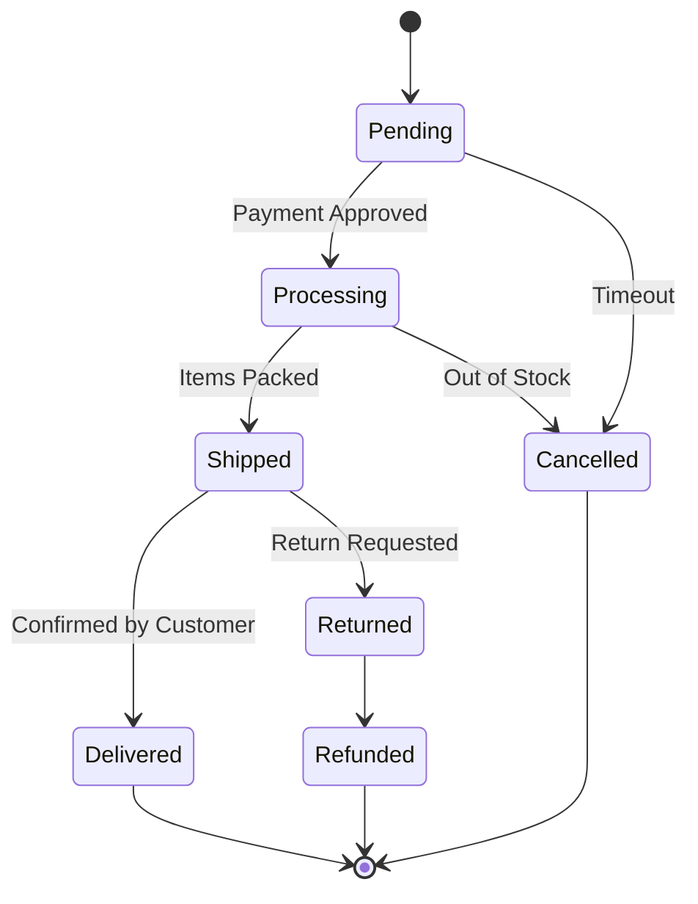
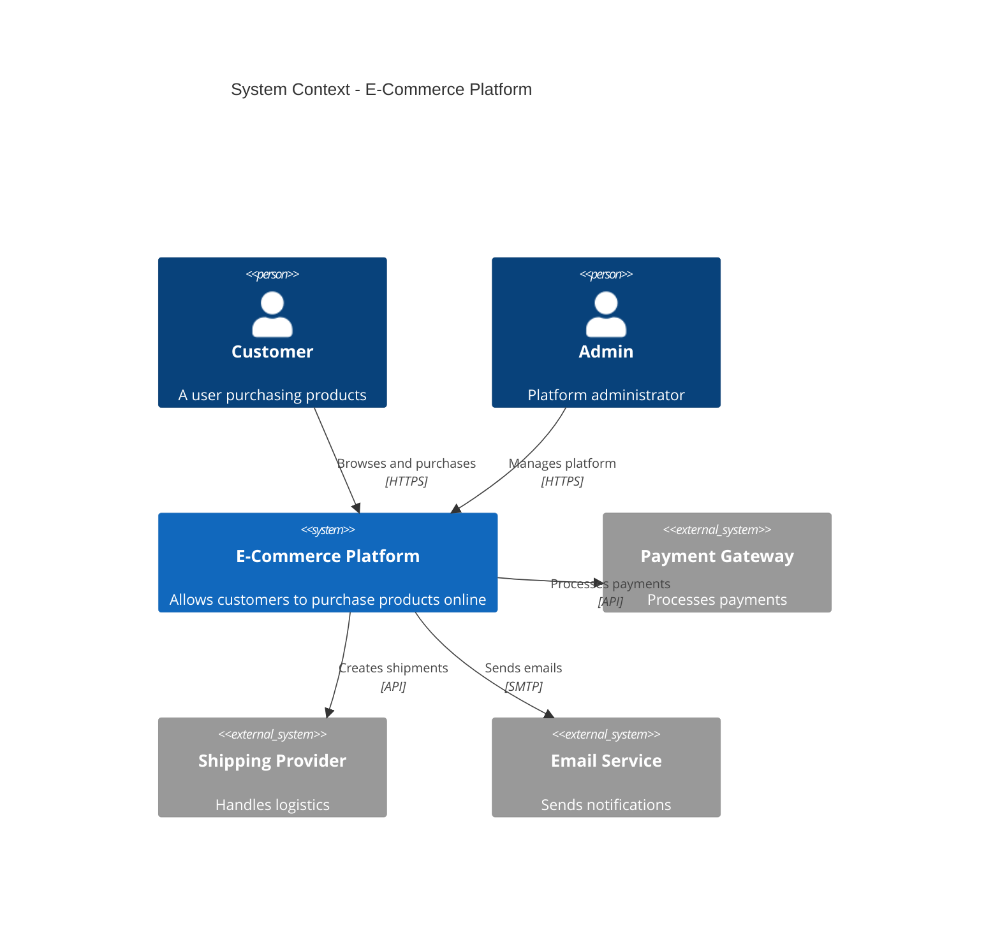
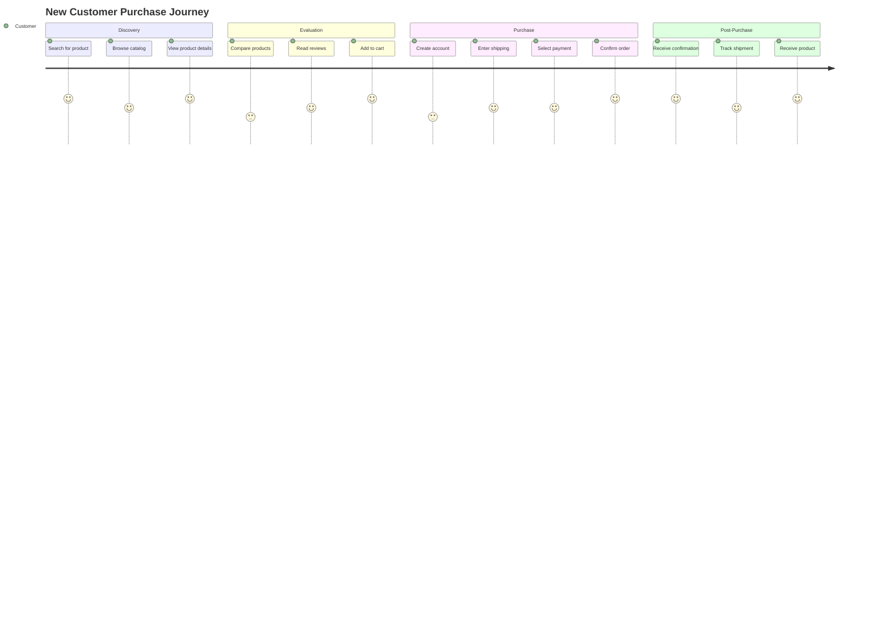
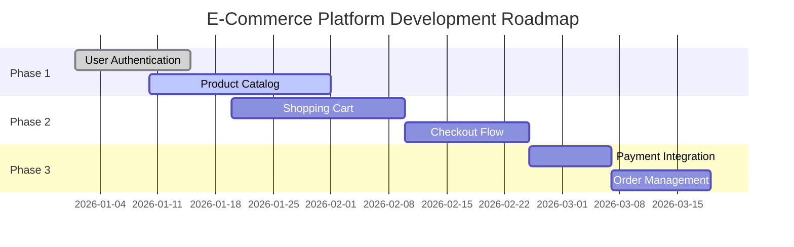

Omni Architect supports 8 different Mermaid diagram types, each serving a specific purpose in visualizing product logic. Configure which diagrams to generate using the `diagram_types` parameter.

## Configuration

<CodeGroup>

```yaml .omni-architect.yml
diagram_types:
  - flowchart
  - sequence
  - erDiagram
  - classDiagram
  - stateDiagram
  - C4Context
  - journey
  - gantt
```

```bash CLI
skills run omni-architect \
  --diagram_types '["flowchart","sequence","erDiagram","classDiagram","stateDiagram","C4Context","journey","gantt"]' \
  # ... other parameters
```

</CodeGroup>

## Default Diagram Types

If not specified, Omni Architect generates these 5 diagram types by default:

```yaml
diagram_types:
  - flowchart
  - sequence
  - erDiagram
  - stateDiagram
  - C4Context
```

## Available Diagram Types

### 1. Flowchart (`flowchart`)

**Purpose**: Visualize business flows and process logic

**PRD Mapping**: Extracted from `flows` section in parsed PRD

**Use Cases**:
- User checkout process
- Authentication flows
- Product search and filtering
- Multi-step forms

**Example Output**:



---

### 2. Sequence Diagram (`sequence`)

**Purpose**: Show interactions between actors and system components

**PRD Mapping**: Extracted from `user_stories` section in parsed PRD

**Use Cases**:
- API request/response flows
- User-system interactions
- Service-to-service communication
- Authentication sequences

**Example Output**:



---

### 3. ER Diagram (`erDiagram`)

**Purpose**: Model data entities and their relationships

**PRD Mapping**: Extracted from `entities` section in parsed PRD

**Use Cases**:
- Database schema design
- Domain model visualization
- Entity relationships
- Data architecture planning

**Example Output**:



---

### 4. Class Diagram (`classDiagram`)

**Purpose**: Visualize object-oriented class structures and relationships

**PRD Mapping**: Extracted from `entities` section with emphasis on behavior and methods

**Use Cases**:
- Object-oriented design
- Class hierarchies and inheritance
- Service layer architecture
- Domain-driven design patterns

**Example Output**:



---

### 5. State Diagram (`stateDiagram`)

**Purpose**: Represent state machines and feature states

**PRD Mapping**: Extracted from `features.states` in parsed PRD

**Use Cases**:
- Order status workflows
- Feature flags and states
- User lifecycle management
- Application state transitions

**Example Output**:



---

### 6. C4 Context Diagram (`C4Context`)

**Purpose**: High-level architectural overview

**PRD Mapping**: Extracted from `system_overview` in parsed PRD

**Use Cases**:
- System context and boundaries
- External integrations
- Microservices architecture
- Platform overview

**Example Output**:



---

### 7. Journey Diagram (`journey`)

**Purpose**: Map user journey and experience

**PRD Mapping**: Extracted from `personas + journeys` in parsed PRD

**Use Cases**:
- User experience mapping
- Customer journey visualization
- Touchpoint analysis
- Emotion and satisfaction tracking

**Example Output**:



---

### 8. Gantt Chart (`gantt`)

**Purpose**: Show roadmap and feature dependencies over time

**PRD Mapping**: Extracted from `dependencies + timeline` in parsed PRD

**Use Cases**:
- Project timeline planning
- Feature dependency tracking
- Sprint planning
- Milestone visualization

**Example Output**:



---

## PRD to Diagram Mapping

| PRD Element | Diagram Type | Purpose |
|-------------|--------------|----------|
| `flows` | `flowchart` | Visualize business flows |
| `user_stories` | `sequence` | Show actor-system interactions |
| `entities` | `erDiagram` | Model data and relationships |
| `features.states` | `stateDiagram` | Represent state machines |
| `system_overview` | `C4Context` | High-level architecture |
| `personas + journeys` | `journey` | User journey maps |
| `dependencies + timeline` | `gantt` | Roadmap and dependencies |

## Selective Generation

You can generate only specific diagram types based on your needs:

### Architecture Focus

```yaml
diagram_types:
  - erDiagram
  - C4Context
```

### User Flow Focus

```yaml
diagram_types:
  - flowchart
  - sequence
  - journey
```

### Project Planning Focus

```yaml
diagram_types:
  - gantt
  - stateDiagram
```

## Automatic Skipping

If your PRD doesn't contain relevant data for a diagram type, Omni Architect automatically skips it:

<Warning>
**Example**: If your PRD has no user stories, sequence diagrams will be automatically skipped even if included in `diagram_types`.
</Warning>

## Best Practices

<AccordionGroup>
  <Accordion title="Start with Core Diagrams">
    Begin with the default 5 diagrams (`flowchart`, `sequence`, `erDiagram`, `stateDiagram`, `C4Context`) which cover most product logic validation needs.
  </Accordion>
  
  <Accordion title="Add Journey for UX Projects">
    Include `journey` when working on user experience-focused features or when presenting to stakeholders who value customer journey visualization.
  </Accordion>
  
  <Accordion title="Use Gantt for Planning">
    Add `gantt` when your PRD includes timeline information or when coordinating with project managers who need visual roadmaps.
  </Accordion>
  
  <Accordion title="ER Diagram is Critical">
    Always include `erDiagram` as it forms the foundation for data consistency across all other diagrams.
  </Accordion>
</AccordionGroup>

## Next Steps

<CardGroup cols={2}>
  <Card title="Validation Modes" icon="check-circle" href="/configuration/validation-modes">
    Learn how diagrams are validated before Figma generation
  </Card>
  <Card title="Design Systems" icon="palette" href="/configuration/design-systems">
    Configure how diagrams are transformed into Figma assets
  </Card>
</CardGroup>