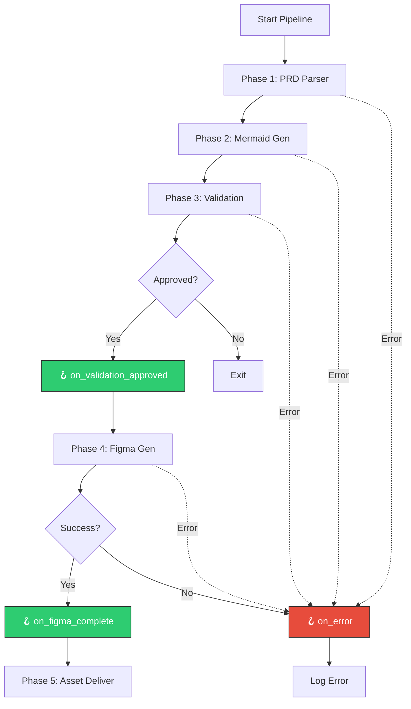

Hooks allow you to integrate Omni Architect into your existing workflows by triggering custom scripts or commands at key points in the pipeline. Use hooks to automate notifications, generate artifacts, or integrate with CI/CD systems.

## Configuration

```yaml .omni-architect.yml
hooks:
  on_validation_approved: "npm run generate:specs"
  on_figma_complete: "npm run notify:slack"
  on_error: "npm run alert:team"
```

## Available Hooks

### `on_validation_approved`

**Triggered**: After diagram validation is approved (all modes)

**Timing**: Before Figma generation begins

**Use Cases**:
- Generate technical specifications from validated diagrams
- Update project documentation
- Trigger downstream processes
- Notify stakeholders of validation success

**Example**:

```yaml
hooks:
  on_validation_approved: "npm run generate:specs"
```

**Script Example** (`package.json`):

```json
{
  "scripts": {
    "generate:specs": "node scripts/generate-specs.js"
  }
}
```

```javascript scripts/generate-specs.js
// scripts/generate-specs.js
const fs = require('fs');

// Read validation report
const report = JSON.parse(
  fs.readFileSync('.omni-architect/validation-report.json', 'utf-8')
);

console.log(`✓ Validation approved with score: ${report.overall_score}`);
console.log('Generating technical specifications...');

// Generate specs from validated diagrams
// ... your custom logic here
```

---

### `on_figma_complete`

**Triggered**: After all Figma assets are successfully generated

**Timing**: After Phase 4 (Figma Generation) completes

**Use Cases**:
- Send Slack/Teams notifications with Figma links
- Update project management tools (Jira, Linear)
- Trigger design review workflows
- Generate design handoff documentation
- Start frontend development tasks

**Example**:

```yaml
hooks:
  on_figma_complete: "npm run notify:slack"
```

**Script Example** (`package.json`):

```json
{
  "scripts": {
    "notify:slack": "node scripts/notify-slack.js"
  }
}
```

```javascript scripts/notify-slack.js
// scripts/notify-slack.js
const fs = require('fs');
const https = require('https');

// Read Figma output
const figmaAssets = JSON.parse(
  fs.readFileSync('.omni-architect/figma-assets.json', 'utf-8')
);

const message = {
  text: `🎨 Figma assets generated for ${figmaAssets.project_name}`,
  blocks: [
    {
      type: 'section',
      text: {
        type: 'mrkdwn',
        text: `*${figmaAssets.project_name}* - Design assets ready!`
      }
    },
    {
      type: 'section',
      fields: figmaAssets.assets.map(asset => ({
        type: 'mrkdwn',
        text: `• <${asset.preview_url}|${asset.type}>: ${asset.name}`
      }))
    }
  ]
};

// Post to Slack webhook
const webhook = process.env.SLACK_WEBHOOK_URL;
const data = JSON.stringify(message);

const options = {
  method: 'POST',
  headers: {
    'Content-Type': 'application/json',
    'Content-Length': data.length
  }
};

const req = https.request(webhook, options, (res) => {
  console.log(`✓ Slack notification sent (${res.statusCode})`);
});

req.write(data);
req.end();
```

---

### `on_error`

**Triggered**: When any error occurs during pipeline execution

**Timing**: Immediately after error detection (any phase)

**Use Cases**:
- Alert team of failures
- Log errors to monitoring systems
- Trigger rollback procedures
- Create incident tickets
- Send email notifications

**Example**:

```yaml
hooks:
  on_error: "npm run alert:team"
```

**Script Example** (`package.json`):

```json
{
  "scripts": {
    "alert:team": "node scripts/alert-team.js"
  }
}
```

```javascript scripts/alert-team.js
// scripts/alert-team.js
const fs = require('fs');
const nodemailer = require('nodemailer');

// Read error log
const errorLog = JSON.parse(
  fs.readFileSync('.omni-architect/error-log.json', 'utf-8')
);

const transporter = nodemailer.createTransport({
  service: 'gmail',
  auth: {
    user: process.env.EMAIL_USER,
    pass: process.env.EMAIL_PASSWORD
  }
});

const mailOptions = {
  from: 'omni-architect@yourcompany.com',
  to: 'product-team@yourcompany.com',
  subject: `🚨 Omni Architect Error - ${errorLog.phase}`,
  html: `
    <h2>Error in ${errorLog.phase}</h2>
    <p><strong>Project:</strong> ${errorLog.project_name}</p>
    <p><strong>Error:</strong> ${errorLog.error_message}</p>
    <p><strong>Time:</strong> ${errorLog.timestamp}</p>
    <pre>${JSON.stringify(errorLog.stack_trace, null, 2)}</pre>
  `
};

transporter.sendMail(mailOptions, (error, info) => {
  if (error) {
    console.error('✗ Failed to send alert:', error);
  } else {
    console.log('✓ Alert sent:', info.response);
  }
});
```

---

## Hook Execution

### Command Format

Hooks can execute any shell command:

```yaml
hooks:
  # npm scripts
  on_validation_approved: "npm run generate:specs"
  
  # Direct shell commands
  on_figma_complete: "echo 'Figma complete!' | mail -s 'Update' team@company.com"
  
  # Shell scripts
  on_error: "./scripts/handle-error.sh"
  
  # Multiple commands (chained with &&)
  on_figma_complete: "npm run generate:docs && npm run deploy:docs"
```

### Execution Context

Hooks execute in the project root directory with access to:

- **Environment variables**: All env vars from the shell
- **Generated artifacts**: Output files in `.omni-architect/` directory
- **Exit codes**: Non-zero exit codes are logged but don't halt execution

### Output Files Available

| File | Hook Availability | Description |
|------|-------------------|-------------|
| `.omni-architect/parsed-prd.json` | `on_validation_approved`+ | Parsed PRD structure |
| `.omni-architect/diagrams/*.mmd` | `on_validation_approved`+ | Mermaid diagram source |
| `.omni-architect/validation-report.json` | `on_validation_approved`+ | Validation scores and feedback |
| `.omni-architect/figma-assets.json` | `on_figma_complete` | Figma node IDs and URLs |
| `.omni-architect/orchestration-log.json` | All hooks | Complete execution log |
| `.omni-architect/error-log.json` | `on_error` | Error details and stack trace |

---

## Common Patterns

### Slack Notification

```yaml
hooks:
  on_figma_complete: "curl -X POST -H 'Content-Type: application/json' -d '{\"text\":\"Figma assets ready!\"}' $SLACK_WEBHOOK_URL"
```

### Jira Ticket Update

```yaml
hooks:
  on_figma_complete: "node scripts/update-jira.js"
```

```javascript scripts/update-jira.js
const axios = require('axios');
const fs = require('fs');

const figmaAssets = JSON.parse(
  fs.readFileSync('.omni-architect/figma-assets.json', 'utf-8')
);

const jiraTicket = process.env.JIRA_TICKET_ID;
const figmaLinks = figmaAssets.assets
  .map(a => `[${a.type}|${a.preview_url}]`)
  .join('\n');

await axios.post(
  `https://yourcompany.atlassian.net/rest/api/3/issue/${jiraTicket}/comment`,
  {
    body: {
      type: 'doc',
      version: 1,
      content: [
        {
          type: 'paragraph',
          content: [
            {
              type: 'text',
              text: `Figma assets generated:\n${figmaLinks}`
            }
          ]
        }
      ]
    }
  },
  {
    auth: {
      username: process.env.JIRA_EMAIL,
      password: process.env.JIRA_API_TOKEN
    }
  }
);

console.log('✓ Jira ticket updated');
```

### Generate Documentation

```yaml
hooks:
  on_validation_approved: "npm run docs:generate"
```

```json package.json
{
  "scripts": {
    "docs:generate": "node scripts/generate-docs.js"
  }
}
```

```javascript scripts/generate-docs.js
const fs = require('fs');
const path = require('path');

const diagrams = fs.readdirSync('.omni-architect/diagrams');
const docsDir = path.join(__dirname, '../docs/architecture');

if (!fs.existsSync(docsDir)) {
  fs.mkdirSync(docsDir, { recursive: true });
}

diagrams.forEach(file => {
  if (file.endsWith('.mmd')) {
    const content = fs.readFileSync(
      `.omni-architect/diagrams/${file}`,
      'utf-8'
    );
    const mdFile = file.replace('.mmd', '.md');
    const mdContent = `# ${file.replace('.mmd', '')}\n\n\`\`\`mermaid\n${content}\n\`\`\`\n`;
    
    fs.writeFileSync(path.join(docsDir, mdFile), mdContent);
  }
});

console.log(`✓ Generated ${diagrams.length} documentation files`);
```

### CI/CD Integration

```yaml
hooks:
  on_validation_approved: "echo 'VALIDATION_PASSED=true' >> $GITHUB_ENV"
  on_figma_complete: "echo 'FIGMA_COMPLETE=true' >> $GITHUB_ENV"
  on_error: "exit 1"  # Fail the CI build on error
```

---

## Best Practices

<AccordionGroup>
  <Accordion title="Use npm Scripts for Complex Logic">
    Keep hook commands simple by delegating to npm scripts:
    ```yaml
    hooks:
      on_figma_complete: "npm run post-figma"  # Better than inline commands
    ```
  </Accordion>
  
  <Accordion title="Handle Errors Gracefully">
    Ensure hook scripts handle errors and log appropriately:
    ```javascript
    try {
      // Your hook logic
    } catch (error) {
      console.error('Hook failed:', error);
      process.exit(0);  // Don't fail the entire pipeline
    }
    ```
  </Accordion>
  
  <Accordion title="Use Environment Variables for Secrets">
    Never hardcode tokens or credentials:
    ```yaml
    hooks:
      on_figma_complete: "node scripts/notify.js"  # Reads from process.env
    ```
  </Accordion>
  
  <Accordion title="Log Hook Execution">
    Add logging to track hook execution:
    ```javascript
    console.log('[Hook] on_figma_complete started');
    // ... your logic
    console.log('[Hook] on_figma_complete completed');
    ```
  </Accordion>
  
  <Accordion title="Test Hooks Independently">
    Test hook scripts outside of Omni Architect:
    ```bash
    # Create test data
    mkdir -p .omni-architect
    echo '{"project_name":"test"}' > .omni-architect/figma-assets.json
    
    # Run hook
    npm run notify:slack
    ```
  </Accordion>
</AccordionGroup>

---

## Hook Execution Flow



---

## Complete Example

Here's a production-ready hook configuration:

```yaml .omni-architect.yml
project_name: "E-Commerce Platform"
figma_file_key: "abc123XYZ"
design_system: "material-3"
locale: "pt-BR"
validation_mode: "auto"
validation_threshold: 0.85

diagram_types:
  - flowchart
  - sequence
  - erDiagram
  - stateDiagram
  - C4Context

design_tokens:
  colors:
    primary: "#4A90D9"
    secondary: "#7B68EE"
    success: "#2ECC71"
    error: "#E74C3C"
    warning: "#FFA500"
  typography:
    font_family: "Inter"
    heading_size: 24
    body_size: 14
  spacing:
    base: 8
    scale: 1.5

hooks:
  on_validation_approved: "npm run generate:specs && npm run notify:team"
  on_figma_complete: "npm run update:jira && npm run notify:slack && npm run deploy:docs"
  on_error: "npm run alert:team && npm run log:sentry"
```

**Corresponding `package.json`**:

```json
{
  "scripts": {
    "generate:specs": "node scripts/generate-specs.js",
    "notify:team": "node scripts/notify-team.js",
    "update:jira": "node scripts/update-jira.js",
    "notify:slack": "node scripts/notify-slack.js",
    "deploy:docs": "node scripts/deploy-docs.js",
    "alert:team": "node scripts/alert-team.js",
    "log:sentry": "node scripts/log-sentry.js"
  },
  "devDependencies": {
    "@slack/webhook": "^7.0.0",
    "axios": "^1.6.0",
    "nodemailer": "^6.9.0",
    "@sentry/node": "^7.100.0"
  }
}
```

---

## Troubleshooting

### Hook Not Executing

**Problem**: Hook command doesn't run

**Solution**:
- Check YAML syntax (proper indentation)
- Verify command exists: `which npm` or `which node`
- Check execution permissions for shell scripts: `chmod +x scripts/hook.sh`
- Review orchestration log: `.omni-architect/orchestration-log.json`

### Hook Fails Silently

**Problem**: Hook runs but doesn't produce expected result

**Solution**:
- Add explicit logging to hook script
- Check exit codes: `echo $?` after running hook manually
- Verify environment variables are set: `printenv | grep SLACK_WEBHOOK`

### Can't Access Output Files

**Problem**: Hook can't read `.omni-architect/*.json` files

**Solution**:
- Ensure hook runs after file generation (correct hook type)
- Check file permissions: `ls -la .omni-architect/`
- Verify file exists before reading:
  ```javascript
  if (fs.existsSync('.omni-architect/figma-assets.json')) {
    // Read file
  }
  ```

---

## Next Steps

<CardGroup cols={2}>
  <Card title="Configuration Overview" icon="gear" href="/configuration/overview">
    Review all configuration options
  </Card>
  <Card title="Pipeline Overview" icon="diagram-project" href="/concepts/pipeline-architecture">
    Understand the complete pipeline flow
  </Card>
</CardGroup>