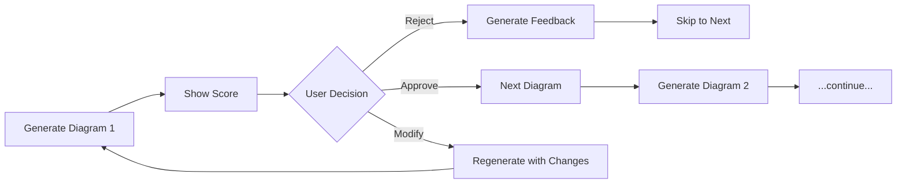
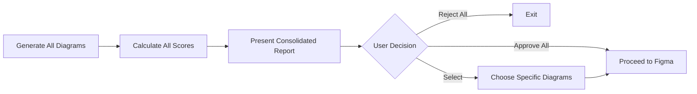
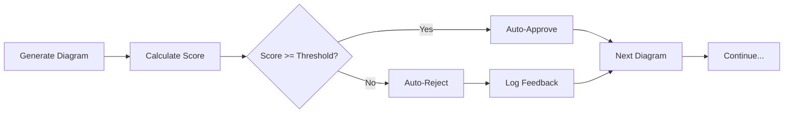

Omni Architect validates diagram coherence before generating Figma assets. The `validation_mode` parameter controls how validation is performed and when approval is required.

## Configuration

<CodeGroup>

```yaml .omni-architect.yml
validation_mode: "interactive"  # interactive | batch | auto
validation_threshold: 0.85      # Used when validation_mode = auto
```

```bash CLI
skills run omni-architect \
  --validation_mode "interactive" \
  --validation_threshold 0.85 \
  # ... other parameters
```

</CodeGroup>

## Validation Modes

### Interactive Mode (Default)

**Value**: `interactive`

**Description**: Presents each diagram individually with its validation score and waits for human approval before proceeding.

**Best For**:
- First-time executions
- Critical product features
- Learning the validation system
- High-stakes projects

**Workflow**:



**User Prompts**:

```bash
✓ Flowchart: Checkout Process
  Score: 0.92 (Coverage: 0.95, Consistency: 0.90, Completeness: 0.91)
  
  Options:
  [a] Approve
  [r] Reject (skip this diagram)
  [m] Modify (provide feedback for regeneration)
  
  Your choice:
```

**Example Configuration**:

```yaml
validation_mode: "interactive"
# validation_threshold is ignored in interactive mode
```

---

### Batch Mode

**Value**: `batch`

**Description**: Generates all diagrams first, presents them together with a consolidated report, then waits for batch approval.

**Best For**:
- Reviewing complete diagram sets
- Stakeholder presentations
- Comparative analysis across diagrams
- Team review sessions

**Workflow**:



**Consolidated Report Example**:

```bash
╔═══════════════════════════════════════════════════════════╗
║ Validation Report - E-Commerce Platform                  ║
╠═══════════════════════════════════════════════════════════╣
║ Overall Score: 0.91 ✓                                     ║
║ Status: APPROVED (above threshold 0.85)                   ║
╠═══════════════════════════════════════════════════════════╣
║ Diagram              │ Score │ Coverage │ Consistency    ║
╠══════════════════════╪═══════╪══════════╪════════════════╣
║ ✓ Flowchart          │ 0.92  │ 0.95     │ 0.90           ║
║ ✓ Sequence Diagram   │ 0.89  │ 0.88     │ 0.91           ║
║ ⚠ ER Diagram         │ 0.83  │ 0.85     │ 0.80           ║
║ ✓ State Diagram      │ 0.94  │ 0.93     │ 0.95           ║
║ ✓ C4 Context         │ 0.96  │ 0.98     │ 0.95           ║
╠═══════════════════════════════════════════════════════════╣
║ Warnings:                                                 ║
║ • ER Diagram: Entity 'Payment' diverges between diagrams  ║
║ • Missing sad path in 'Password Recovery' flow            ║
╠═══════════════════════════════════════════════════════════╣
║ Suggestions:                                              ║
║ • Standardize 'Payment' entity attributes                 ║
║ • Add error handling to Password Recovery                 ║
╚═══════════════════════════════════════════════════════════╝

Options:
[a] Approve All (proceed with all 5 diagrams)
[r] Reject All (cancel Figma generation)
[s] Select (choose specific diagrams to proceed)

Your choice:
```

**Example Configuration**:

```yaml
validation_mode: "batch"
# validation_threshold is used for status display but doesn't block
```

---

### Auto Mode

**Value**: `auto`

**Description**: Automatically approves diagrams that meet or exceed the `validation_threshold` without human intervention.

**Best For**:
- CI/CD pipelines
- Automated workflows
- Iterative refinements
- Production environments (after calibration)

**Workflow**:



**Automated Decision Logic**:

```python
if diagram_score >= validation_threshold:
    status = "APPROVED"
    proceed_to_figma(diagram)
else:
    status = "REJECTED"
    log_feedback(diagram, reasons)
    skip_diagram()
```

**Console Output**:

```bash
✓ Flowchart: Checkout Process (Score: 0.92 >= 0.85) - APPROVED
✓ Sequence Diagram: User Auth (Score: 0.89 >= 0.85) - APPROVED
✗ ER Diagram: Domain Model (Score: 0.83 < 0.85) - REJECTED
  Reasons:
  - Consistency score below threshold (0.80)
  - Entity 'Payment' has conflicting attributes
✓ State Diagram: Order Status (Score: 0.94 >= 0.85) - APPROVED
✓ C4 Context: System Overview (Score: 0.96 >= 0.85) - APPROVED

Proceeding with 4/5 diagrams to Figma generation...
```

**Example Configuration**:

```yaml
validation_mode: "auto"
validation_threshold: 0.85  # Critical parameter for auto mode
```

---

## Validation Threshold

**Parameter**: `validation_threshold`

**Type**: `number` (0.0 - 1.0)

**Default**: `0.85`

**Description**: Minimum coherence score required for automatic approval when using `validation_mode: auto`.

### Recommended Thresholds

| Threshold | Use Case | Risk Level |
|-----------|----------|------------|
| `0.95` | Production-critical features | Very Low |
| `0.90` | Standard product features | Low |
| `0.85` | **Default - Balanced approach** | Medium |
| `0.80` | Rapid prototyping | High |
| `0.75` | Early-stage exploration | Very High |

### Threshold Calibration

<Steps>
  <Step title="Start with Interactive Mode">
    Run several PRDs with `validation_mode: interactive` to see typical scores for your project.
  </Step>
  
  <Step title="Analyze Score Distribution">
    Review the validation reports to understand your average scores:
    ```bash
    Average scores:
    - Coverage: 0.92
    - Consistency: 0.88
    - Completeness: 0.85
    Overall: 0.89
    ```
  </Step>
  
  <Step title="Set Conservative Threshold">
    Set threshold slightly below your average overall score:
    ```yaml
    validation_threshold: 0.85  # If average is 0.89
    ```
  </Step>
  
  <Step title="Test Auto Mode">
    Run a few PRDs with `validation_mode: auto` and monitor rejection rates.
  </Step>
  
  <Step title="Adjust Based on Results">
    - Too many rejections? Lower threshold by 0.05
    - Too many low-quality approvals? Raise threshold by 0.05
  </Step>
</Steps>

---

## Validation Criteria

All modes use the same weighted scoring system:

| Criterion | Weight | Description |
|-----------|--------|-------------|
| **Coverage** | 0.25 | % of PRD features/stories represented in diagrams |
| **Consistency** | 0.25 | Entities and flows consistent across diagrams |
| **Completeness** | 0.20 | All paths (happy/sad) represented |
| **Traceability** | 0.15 | Diagram elements traceable to PRD requirements |
| **Naming Coherence** | 0.10 | Consistent naming across diagrams |
| **Dependency Integrity** | 0.05 | Feature dependencies respected |

**Score Calculation**:

```
overall_score = (coverage × 0.25) + 
                (consistency × 0.25) + 
                (completeness × 0.20) + 
                (traceability × 0.15) + 
                (naming_coherence × 0.10) + 
                (dependency_integrity × 0.05)
```

---

## Validation Report Structure

All modes generate a detailed validation report:

```json
{
  "overall_score": 0.91,
  "status": "approved",
  "breakdown": {
    "coverage": {
      "score": 0.95,
      "weight": 0.25,
      "details": "19/20 features covered"
    },
    "consistency": {
      "score": 0.88,
      "weight": 0.25,
      "details": "Entity 'Payment' diverges between ER and Sequence"
    },
    "completeness": {
      "score": 0.90,
      "weight": 0.20,
      "details": "Missing sad path in 'Password Recovery'"
    },
    "traceability": {
      "score": 0.93,
      "weight": 0.15,
      "details": "All traceable except US018"
    },
    "naming_coherence": {
      "score": 0.92,
      "weight": 0.10,
      "details": "'Usuário' vs 'User' inconsistent"
    },
    "dependency_integrity": {
      "score": 0.98,
      "weight": 0.05,
      "details": "All dependencies respected"
    }
  },
  "warnings": [
    "Entity 'Payment' uses different attributes in ER vs Sequence diagram",
    "User story US018 has no visual representation"
  ],
  "suggestions": [
    "Standardize nomenclature to 'User' across all diagrams",
    "Add error flow to 'Password Recovery'",
    "Map US018 to authentication flowchart"
  ]
}
```

---

## Mode Comparison

| Feature | Interactive | Batch | Auto |
|---------|-------------|-------|------|
| **Human Approval** | Per diagram | All at once | None (auto) |
| **Speed** | Slowest | Medium | Fastest |
| **Control** | Highest | High | Lowest |
| **Best For** | First runs | Reviews | CI/CD |
| **Threshold Use** | Ignored | Display only | Decision criteria |
| **Feedback Loop** | Per diagram | Per batch | Logged only |
| **CI/CD Friendly** | ❌ No | ⚠️ Requires interaction | ✅ Yes |

---

## Best Practices

<AccordionGroup>
  <Accordion title="Use Interactive for First Execution">
    Always start with `validation_mode: interactive` to understand diagram quality and calibrate your expectations.
  </Accordion>
  
  <Accordion title="Batch for Stakeholder Reviews">
    Use `validation_mode: batch` when presenting diagrams to product managers, designers, or technical stakeholders who need the full picture.
  </Accordion>
  
  <Accordion title="Auto for CI/CD Pipelines">
    Once calibrated, use `validation_mode: auto` in automated workflows to enable continuous design generation.
  </Accordion>
  
  <Accordion title="Don't Set Threshold Too Low">
    A threshold below 0.75 often indicates PRD quality issues. Improve your PRD rather than lowering the threshold.
  </Accordion>
  
  <Accordion title="Monitor Rejection Patterns">
    If certain diagram types consistently score low, it may indicate missing sections in your PRD template.
  </Accordion>
  
  <Accordion title="Review ER Diagrams Carefully">
    Entity-Relationship diagrams are foundational. Even in auto mode, consider manually reviewing ER diagram consistency.
  </Accordion>
</AccordionGroup>

---

## Troubleshooting

### Low Coverage Scores

**Problem**: Coverage consistently below 0.80

**Solution**:
- Ensure your PRD includes detailed features and user stories
- Check that PRD sections use recognizable headings (## Feature, ## User Story)
- Add acceptance criteria to each feature

### Low Consistency Scores

**Problem**: Consistency below 0.80

**Solution**:
- Use consistent entity names throughout PRD
- Define entities explicitly in a Data Model section
- Ensure feature dependencies are clearly stated

### Low Completeness Scores

**Problem**: Completeness below 0.80

**Solution**:
- Document error cases and edge cases in PRD
- Include "sad path" scenarios in user stories
- Add validation and error handling requirements

### All Diagrams Auto-Rejected

**Problem**: Every diagram scores below threshold

**Solution**:
1. Lower threshold temporarily (e.g., 0.75)
2. Run in interactive mode to see specific issues
3. Improve PRD based on validation feedback
4. Re-run with original threshold

---

## Next Steps

<CardGroup cols={2}>
  <Card title="Design Systems" icon="palette" href="/configuration/design-systems">
    Configure Material 3, Apple HIG, Tailwind, or custom systems
  </Card>
  <Card title="Hooks" icon="webhook" href="/configuration/hooks">
    Automate actions on validation events
  </Card>
</CardGroup>