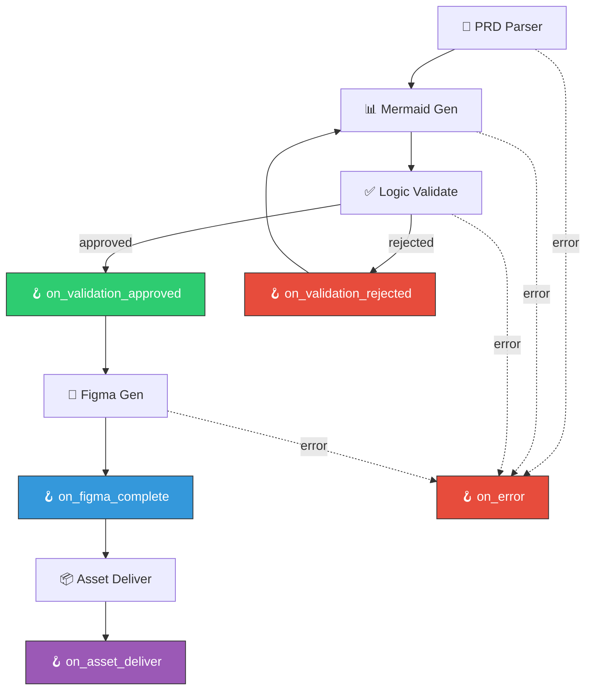
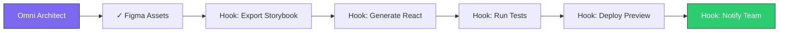

## Overview

Omni Architect provides powerful hooks and extension points to customize the pipeline for your team's specific workflow. This example shows how to integrate with external tools, add custom validation logic, and automate handoff processes.

## Available Hooks

Hooks are defined in `.omni-architect.yml` and execute at key pipeline stages:

```yaml .omni-architect.yml
hooks:
  on_validation_approved: "npm run generate:specs"
  on_figma_complete: "npm run notify:slack"
  on_error: "npm run alert:team"
```

### Hook Lifecycle



## Hook Reference

| Hook | Trigger | Context Variables | Use Cases |
|------|---------|-------------------|------------|
| `on_prd_parsed` | After Phase 1 | `$PRD_PATH`, `$PARSED_JSON` | Validate PRD completeness, auto-tag Jira issues |
| `on_mermaid_generated` | After Phase 2 | `$DIAGRAMS_DIR`, `$DIAGRAM_COUNT` | Generate static images, commit to git |
| `on_validation_approved` | Phase 3 approved | `$VALIDATION_SCORE`, `$REPORT_JSON` | Trigger downstream specs generation |
| `on_validation_rejected` | Phase 3 rejected | `$VALIDATION_SCORE`, `$ERRORS` | Notify PM, log to analytics |
| `on_figma_complete` | After Phase 4 | `$FIGMA_FILE_KEY`, `$ASSET_IDS` | Notify team, update project board |
| `on_asset_deliver` | After Phase 5 | `$OUTPUT_DIR`, `$DELIVERABLES` | Archive artifacts, trigger CI/CD |
| `on_error` | Any phase error | `$PHASE`, `$ERROR_MESSAGE` | Alert ops, rollback, log to Sentry |

## Example 1: Slack Notifications

Notify your team when designs are ready:

<CodeGroup>
```yaml .omni-architect.yml
project_name: "My Product"
figma_file_key: "abc123"

hooks:
  on_figma_complete: "node scripts/notify-slack.js"
```

```javascript scripts/notify-slack.js
const https = require('https');

const SLACK_WEBHOOK = process.env.SLACK_WEBHOOK_URL;
const FIGMA_FILE_KEY = process.env.FIGMA_FILE_KEY;
const ASSET_IDS = process.env.ASSET_IDS.split(',');

const message = {
  text: `🎨 New designs ready!`,
  blocks: [
    {
      type: 'section',
      text: {
        type: 'mrkdwn',
        text: `*New Figma assets generated*\n${ASSET_IDS.length} frames created by Omni Architect`
      }
    },
    {
      type: 'actions',
      elements: [
        {
          type: 'button',
          text: { type: 'plain_text', text: 'View in Figma' },
          url: `https://www.figma.com/file/${FIGMA_FILE_KEY}`
        }
      ]
    }
  ]
};

const postData = JSON.stringify(message);

const options = {
  method: 'POST',
  headers: {
    'Content-Type': 'application/json',
    'Content-Length': postData.length
  }
};

const req = https.request(SLACK_WEBHOOK, options, (res) => {
  console.log(`Slack notification sent: ${res.statusCode}`);
});

req.on('error', (e) => {
  console.error(`Failed to notify Slack: ${e.message}`);
  process.exit(1);
});

req.write(postData);
req.end();
```
</CodeGroup>

**Output in Slack:**

```
🎨 New designs ready!
New Figma assets generated
5 frames created by Omni Architect

[View in Figma] (button)
```

## Example 2: Jira Integration

Auto-update Jira tickets when validation passes:

<CodeGroup>
```yaml .omni-architect.yml
hooks:
  on_validation_approved: "python scripts/update-jira.py"
```

```python scripts/update-jira.py
import os
import json
import requests
from jira import JIRA

# Read validation report
report_path = os.environ['REPORT_JSON']
with open(report_path) as f:
    report = json.load(f)

# Connect to Jira
jira = JIRA(
    server=os.environ['JIRA_SERVER'],
    basic_auth=(os.environ['JIRA_EMAIL'], os.environ['JIRA_API_TOKEN'])
)

# Extract PRD ticket ID from filename
prd_path = os.environ['PRD_PATH']
ticket_id = prd_path.split('/')[-1].split('-')[0]  # e.g., "PROD-123"

# Update ticket
issue = jira.issue(ticket_id)
jira.add_comment(
    issue,
    f"✅ Design validation passed with score {report['overall_score']}\n"
    f"Figma assets generated and ready for review."
)

# Transition to "Design Review" status
jira.transition_issue(issue, 'Design Review')

print(f"Updated {ticket_id} → Design Review")
```
</CodeGroup>

**Result:**
- Jira ticket `PROD-123` automatically moves to "Design Review" status
- Comment added with validation score
- Team is notified via Jira notifications

## Example 3: Git Automation

Commit generated diagrams to version control:

<CodeGroup>
```yaml .omni-architect.yml
hooks:
  on_mermaid_generated: "bash scripts/commit-diagrams.sh"
  on_figma_complete: "bash scripts/commit-figma-links.sh"
```

```bash scripts/commit-diagrams.sh
#!/bin/bash
set -e

DIAGRAMS_DIR="$DIAGRAMS_DIR"
COUNT="$DIAGRAM_COUNT"

echo "Committing $COUNT diagrams to git..."

cd "$DIAGRAMS_DIR"
git add *.mmd *.svg *.png
git commit -m "feat: add $COUNT Mermaid diagrams from Omni Architect

Generated from PRD: $PRD_PATH
Validation score: $VALIDATION_SCORE"

git push origin main

echo "✓ Diagrams committed to main branch"
```

```bash scripts/commit-figma-links.sh
#!/bin/bash
set -e

FIGMA_FILE="https://www.figma.com/file/$FIGMA_FILE_KEY"

# Create Figma links markdown file
cat > docs/figma-assets.md <<EOF
# Figma Design Assets

Generated: $(date)

## Files
- [Main File]($FIGMA_FILE)

## Asset IDs
EOF

for id in ${ASSET_IDS//,/ }; do
  echo "- [Asset $id]($FIGMA_FILE?node-id=$id)" >> docs/figma-assets.md
done

git add docs/figma-assets.md
git commit -m "docs: update Figma asset links"
git push origin main

echo "✓ Figma links documented"
```
</CodeGroup>

## Example 4: Custom Validation Rules

Add team-specific validation on top of Omni Architect's built-in validator:

<CodeGroup>
```yaml .omni-architect.yml
hooks:
  on_validation_approved: "node scripts/custom-validate.js"
```

```javascript scripts/custom-validate.js
const fs = require('fs');

const reportPath = process.env.REPORT_JSON;
const report = JSON.parse(fs.readFileSync(reportPath, 'utf8'));

// Team rule: Must have at least 0.90 coverage score
if (report.breakdown.coverage.score < 0.90) {
  console.error('❌ Custom validation failed: Coverage score < 0.90');
  console.error(`Got: ${report.breakdown.coverage.score}`);
  process.exit(1);
}

// Team rule: Must include ER diagram
const hasDiagrams = fs.existsSync('diagrams/erDiagram.mmd');
if (!hasDiagrams) {
  console.error('❌ Custom validation failed: Missing ER diagram');
  console.error('Team policy requires entity-relationship diagram for all PRDs');
  process.exit(1);
}

// Team rule: Naming must use specific conventions
const diagrams = fs.readdirSync('diagrams');
for (const file of diagrams) {
  const content = fs.readFileSync(`diagrams/${file}`, 'utf8');
  if (content.includes('Usuário') && content.includes('User')) {
    console.error('❌ Custom validation failed: Inconsistent naming (Usuário vs User)');
    process.exit(1);
  }
}

console.log('✅ Custom validation passed');
console.log('  - Coverage score: OK');
console.log('  - ER diagram: Found');
console.log('  - Naming consistency: OK');
```
</CodeGroup>

## Example 5: Storybook Export

Generate Storybook documentation from Figma assets:

<CodeGroup>
```yaml .omni-architect.yml
hooks:
  on_figma_complete: "npm run export:storybook"
```

```json package.json
{
  "scripts": {
    "export:storybook": "node scripts/figma-to-storybook.js"
  },
  "devDependencies": {
    "figma-api": "^1.11.0",
    "@storybook/cli": "^7.0.0"
  }
}
```

```javascript scripts/figma-to-storybook.js
const Figma = require('figma-api');
const fs = require('fs');

const api = new Figma.Api({
  personalAccessToken: process.env.FIGMA_ACCESS_TOKEN
});

const fileKey = process.env.FIGMA_FILE_KEY;
const assetIds = process.env.ASSET_IDS.split(',');

async function exportToStorybook() {
  const file = await api.getFile(fileKey);
  
  for (const nodeId of assetIds) {
    const node = findNode(file.document, nodeId);
    if (!node) continue;
    
    // Generate Storybook story
    const story = `
import React from 'react';

export default {
  title: 'Designs/${node.name}',
  parameters: {
    design: {
      type: 'figma',
      url: 'https://www.figma.com/file/${fileKey}?node-id=${nodeId}'
    }
  }
};

export const Default = () => (
  <div>
    <h2>${node.name}</h2>
    <p>View this design in Figma using the Design panel</p>
  </div>
);
`;
    
    const filename = node.name.toLowerCase().replace(/\s+/g, '-');
    fs.writeFileSync(
      `stories/${filename}.stories.jsx`,
      story
    );
    
    console.log(`✓ Created story: ${filename}`);
  }
}

function findNode(node, targetId) {
  if (node.id === targetId) return node;
  if (!node.children) return null;
  
  for (const child of node.children) {
    const found = findNode(child, targetId);
    if (found) return found;
  }
  return null;
}

exportToStorybook().catch(console.error);
```
</CodeGroup>

**Result:**
```
✓ Created story: checkout-flow
✓ Created story: user-authentication
✓ Created story: domain-er-diagram
```

## Example 6: Analytics & Metrics

Track pipeline metrics over time:

<CodeGroup>
```yaml .omni-architect.yml
hooks:
  on_asset_deliver: "node scripts/log-metrics.js"
```

```javascript scripts/log-metrics.js
const fs = require('fs');
const path = require('path');

const report = JSON.parse(fs.readFileSync(process.env.REPORT_JSON, 'utf8'));
const log = JSON.parse(fs.readFileSync(process.env.ORCHESTRATION_LOG, 'utf8'));

const metrics = {
  timestamp: new Date().toISOString(),
  project: process.env.PROJECT_NAME,
  validation_score: report.overall_score,
  diagram_count: process.env.DIAGRAM_COUNT,
  figma_assets: process.env.ASSET_IDS.split(',').length,
  duration_seconds: log.total_duration_ms / 1000,
  phases: {
    parse: log.phases.parse.duration_ms,
    generate: log.phases.generate.duration_ms,
    validate: log.phases.validate.duration_ms,
    figma: log.phases.figma.duration_ms
  }
};

// Append to metrics log
const metricsFile = 'metrics/pipeline-metrics.jsonl';
fs.appendFileSync(metricsFile, JSON.stringify(metrics) + '\n');

console.log('✓ Metrics logged:', metrics);

// Check if we're improving over time
const allMetrics = fs.readFileSync(metricsFile, 'utf8')
  .split('\n')
  .filter(Boolean)
  .map(JSON.parse);

if (allMetrics.length >= 5) {
  const recentScores = allMetrics.slice(-5).map(m => m.validation_score);
  const avgScore = recentScores.reduce((a, b) => a + b) / 5;
  
  if (avgScore > 0.90) {
    console.log(`🎉 Average validation score: ${avgScore.toFixed(2)} (last 5 runs)`);
  } else {
    console.log(`⚠️  Average validation score: ${avgScore.toFixed(2)} (target: 0.90)`);
  }
}
```
</CodeGroup>

## Hook Best Practices

<CardGroup cols={2}>
  <Card title="Exit Codes Matter" icon="circle-xmark">
    Return non-zero exit codes to halt the pipeline on errors.
  </Card>
  <Card title="Use Environment Variables" icon="code">
    All context is passed via env vars like `$FIGMA_FILE_KEY`.
  </Card>
  <Card title="Keep Hooks Fast" icon="gauge-high">
    Hooks should complete in < 10 seconds to avoid blocking the pipeline.
  </Card>
  <Card title="Handle Failures Gracefully" icon="shield-check">
    Log errors and use `on_error` hook for cleanup.
  </Card>
</CardGroup>

## Available Context Variables

```bash
# PRD Phase
export PRD_PATH="./docs/prd.md"
export PARSED_JSON="./output/parsed-prd.json"
export PROJECT_NAME="My Project"

# Mermaid Phase
export DIAGRAMS_DIR="./output/diagrams"
export DIAGRAM_COUNT="5"
export DIAGRAM_TYPES="flowchart,sequence,erDiagram"

# Validation Phase
export VALIDATION_SCORE="0.93"
export REPORT_JSON="./output/validation-report.json"
export VALIDATION_STATUS="approved"

# Figma Phase
export FIGMA_FILE_KEY="abc123XYZ"
export FIGMA_ACCESS_TOKEN="figd_xxxx"
export ASSET_IDS="123:456,123:789,123:012"

# Delivery Phase
export OUTPUT_DIR="./output"
export DELIVERABLES="./output/deliverables.json"
export ORCHESTRATION_LOG="./output/orchestration.log"

# Error Handling
export PHASE="mermaid-gen"
export ERROR_MESSAGE="Syntax error in flowchart"
export ERROR_CODE="MERMAID_SYNTAX_ERROR"
```

## Advanced: Multi-Stage Workflows

Chain multiple tools together:



```yaml .omni-architect.yml
hooks:
  on_figma_complete: |
    # Multi-command pipeline
    npm run export:storybook && \
    npm run generate:react-components && \
    npm test && \
    npm run deploy:preview && \
    node scripts/notify-slack.js
```

<Warning>
Multi-command hooks should use `&&` to ensure each step succeeds before continuing. Use `set -e` in bash scripts.
</Warning>

## Troubleshooting Hooks

| Issue | Solution |
|-------|----------|
| Hook not executing | Check file permissions: `chmod +x scripts/*.sh` |
| Environment vars missing | Hooks inherit from skill runner; export vars before running |
| Timeout | Default hook timeout is 60s; keep hooks fast or run async |
| Non-zero exit ignored | Ensure script returns correct exit code: `process.exit(1)` |
| Path issues | Hooks run in project root; use absolute paths or `cd` first |

## Real-World Workflow Example

Complete CI/CD pipeline for a product team:

```yaml .omni-architect.yml
project_name: "E-Commerce Platform"
figma_file_key: "abc123XYZ"
design_system: "material-3"
validation_mode: "auto"
validation_threshold: 0.88

hooks:
  # After PRD parsed → Validate completeness
  on_prd_parsed: |
    node scripts/validate-prd-completeness.js
  
  # After diagrams generated → Commit to git
  on_mermaid_generated: |
    bash scripts/commit-diagrams.sh
  
  # After validation approved → Update Jira & generate specs
  on_validation_approved: |
    python scripts/update-jira.py && \
    npm run generate:api-specs
  
  # After Figma complete → Notify team & export Storybook
  on_figma_complete: |
    node scripts/notify-slack.js && \
    npm run export:storybook && \
    npm run deploy:storybook-preview
  
  # After delivery → Log metrics & trigger downstream
  on_asset_deliver: |
    node scripts/log-metrics.js && \
    curl -X POST $CI_WEBHOOK_URL \
      -d '{"event": "omni_architect_complete"}'
  
  # On any error → Alert team & rollback
  on_error: |
    node scripts/alert-team.js && \
    bash scripts/rollback-changes.sh
```

<Tip>
Start simple with one hook (e.g., Slack notifications) and gradually add more as your team's workflow matures.
</Tip>

## Next Steps

<CardGroup cols={2}>
  <Card title="CI/CD Integration" icon="gears" href="/examples/cicd-integration">
    Run Omni Architect in GitHub Actions
  </Card>
  <Card title="Configuration Reference" icon="file-code" href="/configuration/overview">
    Complete YAML configuration docs
  </Card>
  <Card title="API Reference" icon="brackets-curly" href="/configuration/hooks">
    Programmatic hook API
  </Card>
  <Card title="Troubleshooting" icon="wrench" href="/guides/troubleshooting">
    Debug common hook issues
  </Card>
</CardGroup>