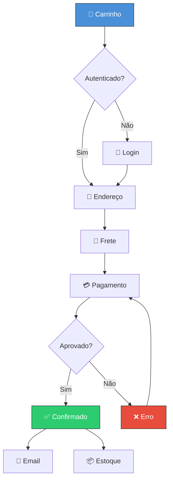
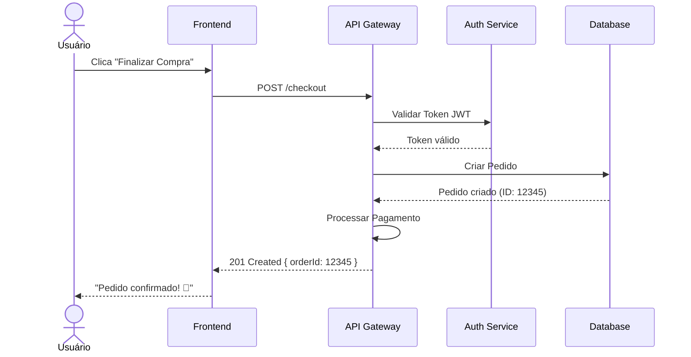
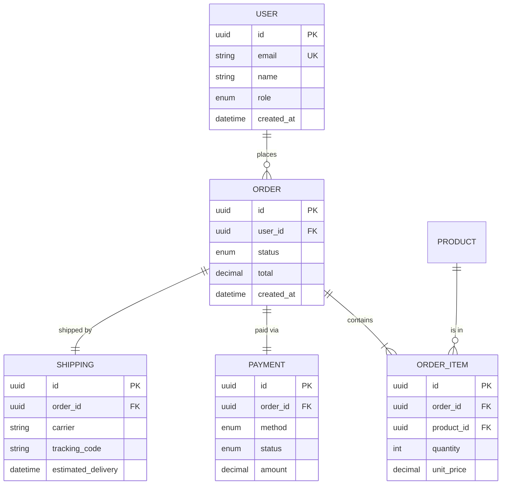

## Overview

This example walks through a complete e-commerce platform implementation using Omni Architect. We'll transform a PRD for a checkout flow into validated Mermaid diagrams and production-ready Figma assets.

## The PRD

Here's our starting PRD for the checkout feature:

```markdown prd-ecommerce.md
## Feature: Checkout Flow

### User Story
Como **comprador**, quero **finalizar minha compra em até 3 passos**,
para que eu tenha uma **experiência rápida e sem fricção**.

### Acceptance Criteria
- [ ] Usuário pode selecionar endereço salvo ou cadastrar novo
- [ ] Cálculo de frete em tempo real
- [ ] Suporte a PIX, cartão e boleto
- [ ] Confirmação por email automática

### Entities
| Entity | Attributes |
|--------|------------|
| User | id, email, name, role, created_at |
| Order | id, user_id, status, total, created_at |
| OrderItem | id, order_id, product_id, quantity, unit_price |
| Payment | id, order_id, method, status, amount |
| Shipping | id, order_id, carrier, tracking_code, estimated_delivery |
```

## Running Omni Architect

<Steps>
  <Step title="Set up environment variables">
    Export your Figma token:
    
    ```bash
    export FIGMA_TOKEN="your-personal-access-token"
    ```
  </Step>

  <Step title="Run the pipeline">
    Execute Omni Architect with the e-commerce PRD:
    
    ```bash
    skills run omni-architect \
      --prd_source "./docs/prd-ecommerce.md" \
      --project_name "E-Commerce Platform" \
      --figma_file_key "abc123XYZ" \
      --figma_access_token "$FIGMA_TOKEN" \
      --diagram_types '["flowchart","sequence","erDiagram"]' \
      --design_system "material-3" \
      --validation_mode "interactive" \
      --locale "pt-BR"
    ```
  </Step>

  <Step title="Review generated diagrams">
    The pipeline will generate Mermaid diagrams for validation.
  </Step>

  <Step title="Approve and generate Figma assets">
    Once approved, Figma assets are automatically created.
  </Step>
</Steps>

## Generated Diagrams

### Flowchart: Checkout Flow

The pipeline automatically generates this flowchart from the PRD:



### Sequence Diagram: Checkout Process

Interaction flow between user and system:



### ER Diagram: Data Model

Entity relationships extracted from the PRD:



## Validation Report

The logic validator generates a comprehensive report:

```json
{
  "overall_score": 0.93,
  "status": "approved",
  "breakdown": {
    "coverage": {
      "score": 0.95,
      "weight": 0.25,
      "details": "All 4 acceptance criteria represented"
    },
    "consistency": {
      "score": 0.92,
      "weight": 0.25,
      "details": "Entities consistent across diagrams"
    },
    "completeness": {
      "score": 0.90,
      "weight": 0.20,
      "details": "Both happy and error paths covered"
    },
    "traceability": {
      "score": 0.95,
      "weight": 0.15,
      "details": "All flows traceable to PRD requirements"
    },
    "naming_coherence": {
      "score": 0.90,
      "weight": 0.10,
      "details": "Consistent Portuguese naming"
    },
    "dependency_integrity": {
      "score": 1.00,
      "weight": 0.05,
      "details": "All dependencies satisfied"
    }
  },
  "warnings": [],
  "suggestions": [
    "Consider adding a state diagram for order status transitions",
    "Add C4 context diagram for system architecture overview"
  ]
}
```

<Note>
The validation score of **0.93** exceeds the default threshold of 0.85, so the diagrams are automatically approved for Figma generation.
</Note>

## Generated Figma Assets

Once approved, the pipeline creates this structure in Figma:

```
📁 E-Commerce Platform - Omni Architect
├── 📄 Index
├── 📄 User Flows
│   ├── 🖼️ Checkout Flow
│   ├── 🖼️ Authentication Flow
│   └── 🖼️ Product Search Flow
├── 📄 Interaction Specs
│   └── 🖼️ Checkout Sequence
├── 📄 Data Model
│   └── 🖼️ Domain ER Diagram
└── 📄 Component Library
    ├── 🧩 Design Tokens
    └── 🧩 Flow Connectors
```

### Example Output

The Figma generator returns asset details:

```json
{
  "figma_assets": [
    {
      "type": "flow",
      "name": "Checkout Flow",
      "node_id": "123:456",
      "preview_url": "https://www.figma.com/file/abc123XYZ?node-id=123:456",
      "page": "User Flows"
    },
    {
      "type": "sequence",
      "name": "Checkout Sequence",
      "node_id": "123:789",
      "preview_url": "https://www.figma.com/file/abc123XYZ?node-id=123:789",
      "page": "Interaction Specs"
    },
    {
      "type": "er_diagram",
      "name": "Domain ER Diagram",
      "node_id": "123:012",
      "preview_url": "https://www.figma.com/file/abc123XYZ?node-id=123:012",
      "page": "Data Model"
    }
  ],
  "component_library": {
    "tokens": "123:345",
    "connectors": "123:678"
  }
}
```

## Best Practices

<CardGroup cols={2}>
  <Card title="Complete PRDs" icon="file-lines">
    Include all acceptance criteria, entities, and user stories for maximum coverage.
  </Card>
  <Card title="Entity Consistency" icon="diagram-project">
    Use consistent entity names across all PRD sections.
  </Card>
  <Card title="Happy & Error Paths" icon="code-branch">
    Document both success and failure scenarios in your PRD.
  </Card>
  <Card title="Interactive Mode First" icon="sliders">
    Use `validation_mode: "interactive"` for the first run to calibrate quality.
  </Card>
</CardGroup>

## Results

With this e-commerce example:
- **Coverage**: 95% of PRD features represented in diagrams
- **Time**: 45 seconds from PRD to Figma assets
- **Validation**: Score of 0.93 (above 0.85 threshold)
- **Assets**: 3 major diagrams + component library

<Tip>
See the complete example PRD at [`examples/prd-ecommerce.md`](https://github.com/fabioeloi/omni-architect/blob/main/examples/prd-ecommerce.md) in the repository.
</Tip>

## Next Steps

<CardGroup cols={2}>
  <Card title="Customize Design System" icon="palette" href="/configuration/design-tokens">
    Apply your brand's design tokens
  </Card>
  <Card title="Add More Diagrams" icon="diagram-project" href="/configuration/diagram-types">
    Generate state and C4 diagrams
  </Card>
  <Card title="CI/CD Integration" icon="gears" href="/examples/cicd-integration">
    Automate the pipeline
  </Card>
  <Card title="Custom Workflows" icon="code-branch" href="/examples/custom-workflows">
    Use hooks for custom logic
  </Card>
</CardGroup>