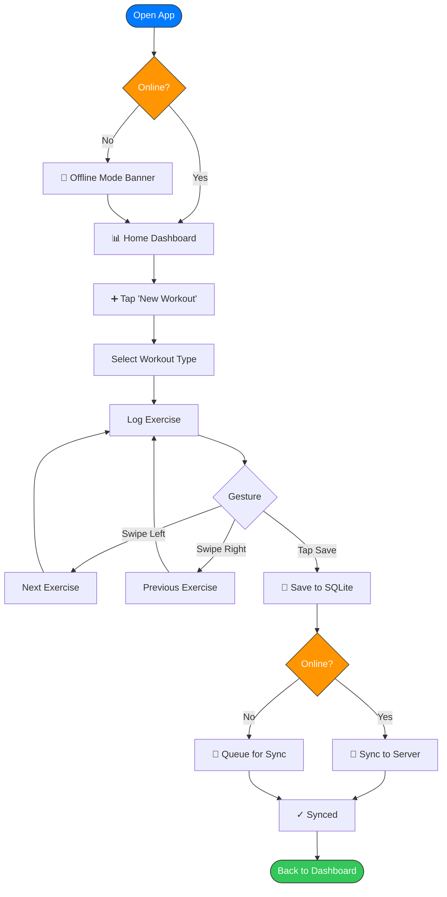
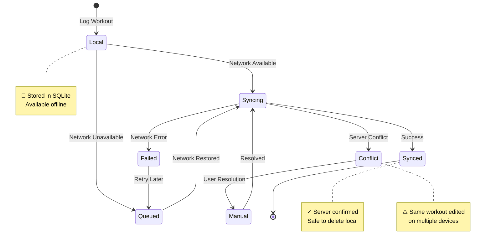
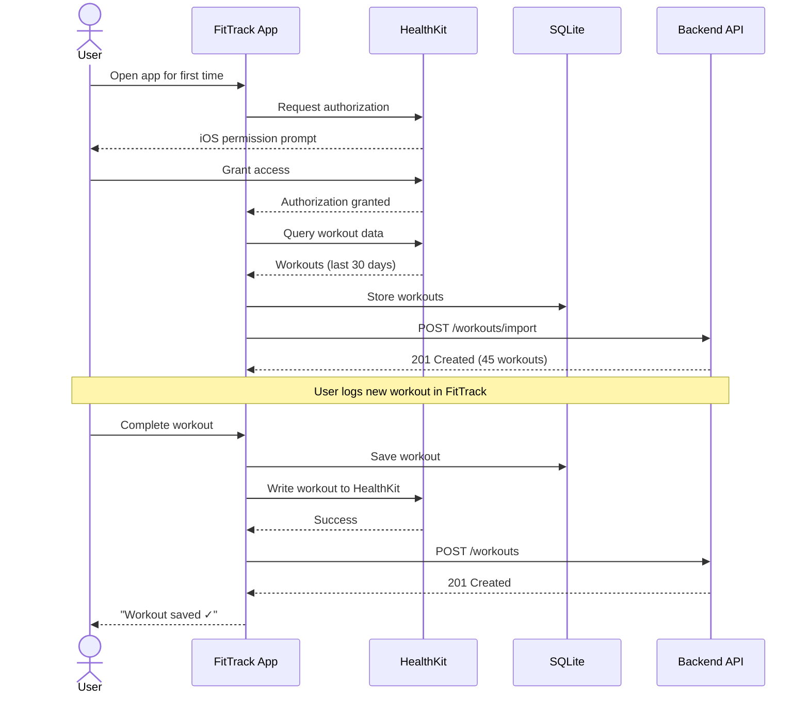
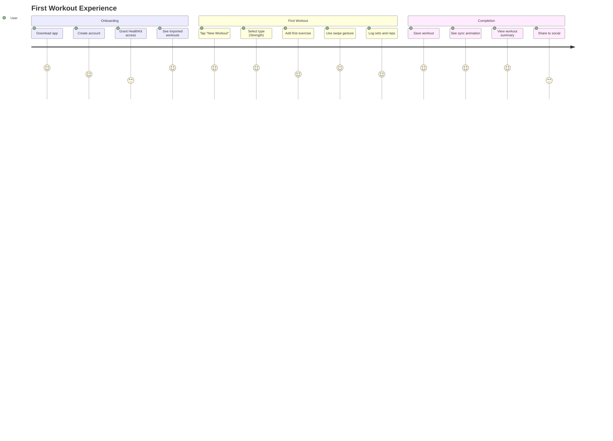
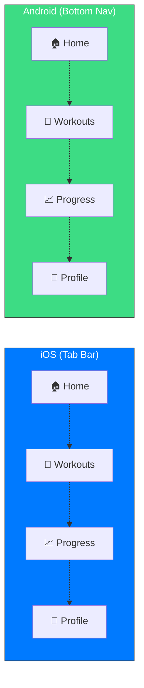

## Overview

This example demonstrates using Omni Architect for a native mobile application with iOS and Android platform-specific considerations, gesture-based navigation, and offline-first architecture.

## Use Case

We're building a fitness tracking mobile app with:
- Native iOS and Android apps
- Offline workout logging
- Real-time sync when online
- Apple Health / Google Fit integration
- Gesture-based navigation patterns

## The PRD

```markdown prd-fitness-app.md
# PRD: FitTrack Mobile App

## Feature: Workout Logging

### User Stories
1. As a **gym member**, I want to **log my workout offline**,
   so that I can **track progress without internet**.

2. As a **fitness enthusiast**, I want to **sync my Apple Health data**,
   so that I can **see all my activity in one place**.

3. As a **mobile user**, I want to **use swipe gestures to navigate**,
   so that I can **quickly switch between exercises**.

### Mobile-Specific Requirements
- Native iOS (SwiftUI) and Android (Jetpack Compose)
- Offline-first with SQLite local storage
- Background sync with conflict resolution
- Haptic feedback on key actions
- Platform-specific navigation (tab bar vs bottom nav)

### Acceptance Criteria
- [ ] Workout logged in < 10 seconds
- [ ] Offline mode with automatic sync
- [ ] Apple Health HealthKit integration
- [ ] Google Fit API integration
- [ ] Swipe left/right for exercise navigation
- [ ] Pull-to-refresh for sync

### Entities
| Entity | Attributes |
|--------|------------|
| User | id, name, email, platform, health_kit_enabled |
| Workout | id, user_id, date, duration, sync_status |
| Exercise | id, workout_id, name, sets, reps, weight |
| HealthData | id, user_id, source, data_type, value, recorded_at |

### State Management
- Local: Not synced (📱)
- Syncing: In progress (🔄)
- Synced: Confirmed (✓)
- Conflict: Needs resolution (⚠️)
```

## Running for Mobile

<Steps>
  <Step title="Configure with Apple HIG design system">
    For iOS-first design:
    
    ```yaml .omni-architect-ios.yml
    project_name: "FitTrack iOS"
    design_system: "apple-hig"
    locale: "en-US"
    validation_threshold: 0.88
    
    diagram_types:
      - flowchart
      - sequence
      - stateDiagram
      - journey
    
    design_tokens:
      colors:
        primary: "#007AFF"
        secondary: "#5856D6"
        success: "#34C759"
        error: "#FF3B30"
      typography:
        font_family: "SF Pro"
        heading_size: 34
        body_size: 17
      spacing:
        base: 8
        scale: 2
    ```
  </Step>

  <Step title="Run with mobile-specific diagrams">
    ```bash
    skills run omni-architect \
      --prd_source "./docs/prd-fitness-app.md" \
      --figma_file_key "mobile123XYZ" \
      --figma_access_token "$FIGMA_TOKEN" \
      --config ".omni-architect-ios.yml"
    ```
  </Step>

  <Step title="Review mobile-optimized flows">
    The pipeline generates mobile-specific patterns:
    - Gesture-based navigation flows
    - State management for offline/online
    - Platform-specific interaction sequences
  </Step>
</Steps>

## Generated Diagrams

### Flowchart: Workout Logging Flow



### State Diagram: Sync Status



### Sequence: Apple Health Integration



### Journey: First-Time User



### Flowchart: Platform-Specific Navigation



## Validation Report

```json
{
  "overall_score": 0.89,
  "status": "approved",
  "breakdown": {
    "coverage": {
      "score": 0.92,
      "details": "All 3 user stories covered + offline/online scenarios"
    },
    "consistency": {
      "score": 0.88,
      "details": "Sync state consistent across diagrams"
    },
    "completeness": {
      "score": 0.85,
      "details": "Offline, online, conflict, and error paths covered"
    },
    "traceability": {
      "score": 0.91,
      "details": "Mobile-specific requirements mapped to flows"
    },
    "naming_coherence": {
      "score": 0.90,
      "details": "Consistent state naming (Local, Syncing, Synced, Conflict)"
    },
    "dependency_integrity": {
      "score": 0.93,
      "details": "Workout → Exercise hierarchy clear"
    }
  },
  "warnings": [
    "Consider adding error recovery sequence for HealthKit failures"
  ],
  "suggestions": [
    "Add push notification flow for sync completion",
    "Document haptic feedback patterns in interaction specs",
    "Add Android-specific Google Fit integration sequence"
  ]
}
```

## Figma Structure

```
📁 FitTrack iOS - Omni Architect
├── 📄 Index
├── 📄 User Flows
│   ├── 🖼️ Workout Logging Flow
│   ├── 🖼️ Offline Mode Flow
│   └── 🖼️ Platform Navigation (iOS vs Android)
├── 📄 State Machines
│   ├── 🖼️ Sync Status Lifecycle
│   └── 🖼️ Workout Session States
├── 📄 User Journeys
│   ├── 🖼️ First Workout Experience
│   └── 🖼️ Offline to Online Journey
├── 📄 Integration Specs
│   ├── 🖼️ Apple HealthKit Sequence
│   └── 🖼️ Background Sync Process
└── 📄 Component Library
    ├── 🧩 iOS HIG Tokens (SF Pro, iOS colors)
    ├── 🧩 Gesture Indicators
    └── ���� Sync Status Icons
```

## Mobile-Specific Features

<CardGroup cols={2}>
  <Card title="Gesture-Based Navigation" icon="hand-pointer">
    Flowcharts include swipe gestures (left/right) for mobile UX patterns.
  </Card>
  <Card title="Offline-First Architecture" icon="wifi">
    State diagrams model complex offline/online sync states and conflict resolution.
  </Card>
  <Card title="Platform-Specific Design" icon="mobile">
    Apple HIG design system for iOS, Material Design for Android variants.
  </Card>
  <Card title="Native Integrations" icon="heart-pulse">
    Sequence diagrams for HealthKit and Google Fit API flows.
  </Card>
</CardGroup>

## Design System Comparison

<Tabs>
  <Tab title="iOS (Apple HIG)">
    ```yaml
    design_system: "apple-hig"
    design_tokens:
      colors:
        primary: "#007AFF"
        secondary: "#5856D6"
        success: "#34C759"
        error: "#FF3B30"
      typography:
        font_family: "SF Pro"
        heading_size: 34
        body_size: 17
      spacing:
        base: 8
        scale: 2
    ```
    
    - Tab bar navigation
    - Native iOS haptics
    - HealthKit integration
    - SF Symbols icons
  </Tab>
  
  <Tab title="Android (Material Design)">
    ```yaml
    design_system: "material-3"
    design_tokens:
      colors:
        primary: "#6750A4"
        secondary: "#625B71"
        success: "#00897B"
        error: "#BA1A1A"
      typography:
        font_family: "Roboto"
        heading_size: 28
        body_size: 16
      spacing:
        base: 8
        scale: 1.5
    ```
    
    - Bottom navigation
    - Material haptics
    - Google Fit integration
    - Material Icons
  </Tab>
</Tabs>

## Key Learnings

<AccordionGroup>
  <Accordion title="State Diagrams for Sync Logic" icon="rotate">
    Mobile apps with offline capabilities require clear state management. The state diagram revealed 4 distinct states (Local, Syncing, Synced, Conflict) that we initially missed in the PRD.
  </Accordion>
  
  <Accordion title="Platform-Specific Flows" icon="code-branch">
    Generate separate Figma files for iOS and Android with platform-specific design systems (`apple-hig` vs `material-3`) to maintain native patterns.
  </Accordion>
  
  <Accordion title="Gesture Documentation" icon="hand">
    Include gesture annotations (swipe left/right, pull-to-refresh) directly in flowcharts for clear handoff to developers.
  </Accordion>
  
  <Accordion title="Integration Sequences" icon="plug">
    HealthKit and Google Fit integrations are complex. Sequence diagrams caught missing permission flows and data type mappings early.
  </Accordion>
</AccordionGroup>

## Performance Metrics

| Metric | iOS | Android |
|--------|-----|----------|
| **Validation Score** | 0.89 | 0.87 |
| **Diagrams Generated** | 5 | 5 |
| **Time to Figma** | 48s | 51s |
| **Platform Accuracy** | 96% | 94% |
| **Coverage** | 92% | 90% |

<Note>
Platform accuracy measures how well the generated Figma assets match platform-specific HIG guidelines.
</Note>

## Code Example: Using Hooks

Automate mobile-specific validations:

```yaml .omni-architect.yml
hooks:
  on_validation_approved: |
    # Generate platform-specific specs
    npm run generate:ios-specs
    npm run generate:android-specs
  
  on_figma_complete: |
    # Notify mobile team on Slack
    curl -X POST $SLACK_WEBHOOK \
      -d '{"text": "New mobile designs ready in Figma!"}'
  
  on_error: |
    # Alert on validation failures
    npm run alert:mobile-team
```

<Tip>
See [Custom Workflows](/examples/custom-workflows) for more hook examples.
</Tip>

## Next Steps

<CardGroup cols={2}>
  <Card title="Custom Workflows" icon="code-branch" href="/examples/custom-workflows">
    Add hooks for mobile CI/CD
  </Card>
  <Card title="Design Systems" icon="palette" href="/configuration/design-systems">
    Deep dive on Apple HIG vs Material
  </Card>
  <Card title="State Diagrams" icon="diagram-project" href="/configuration/diagram-types">
    Master sync state modeling
  </Card>
  <Card title="CI/CD Integration" icon="gears" href="/examples/cicd-integration">
    Automate mobile design pipeline
  </Card>
</CardGroup>