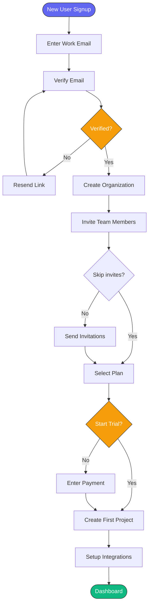
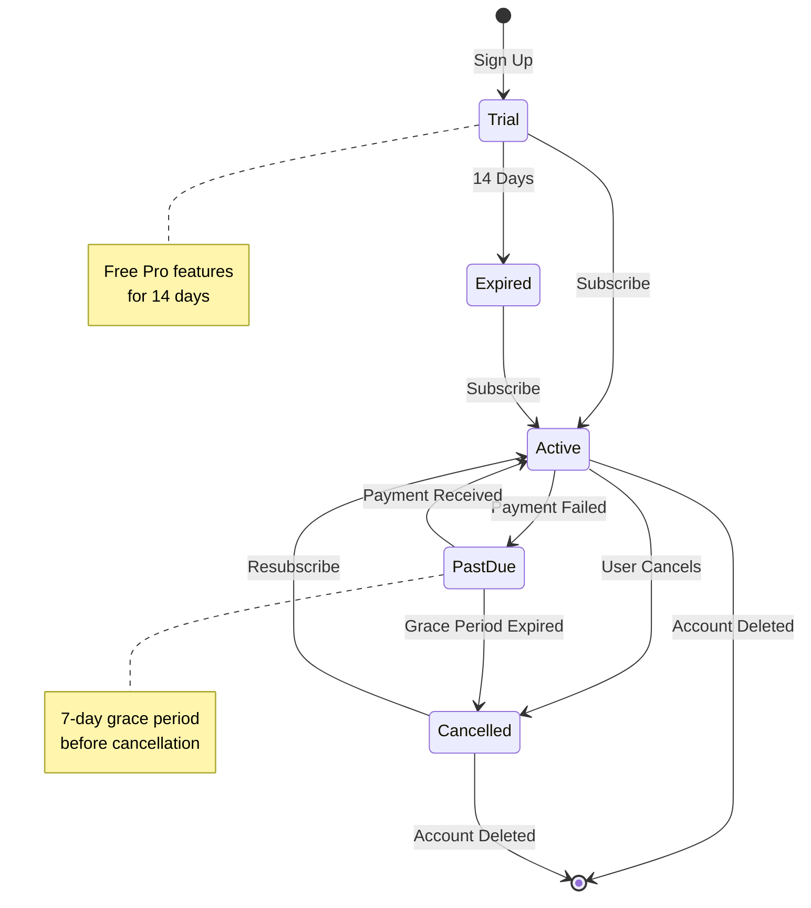
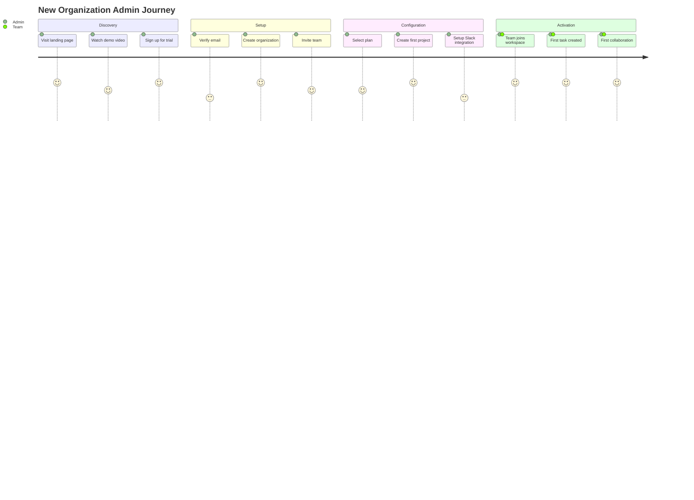
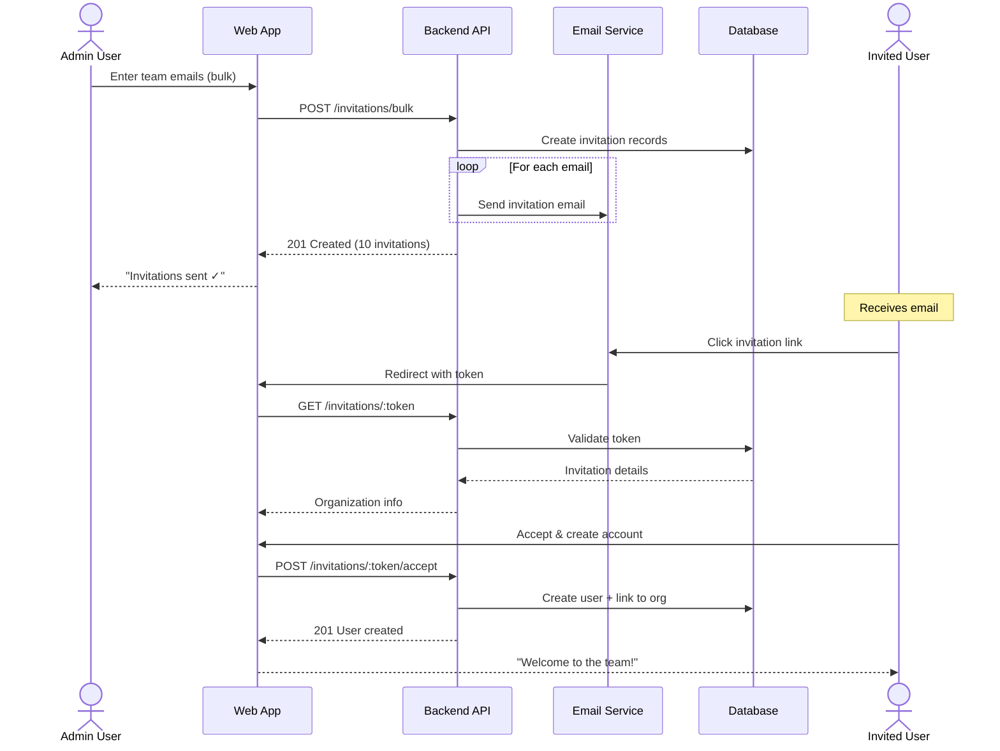
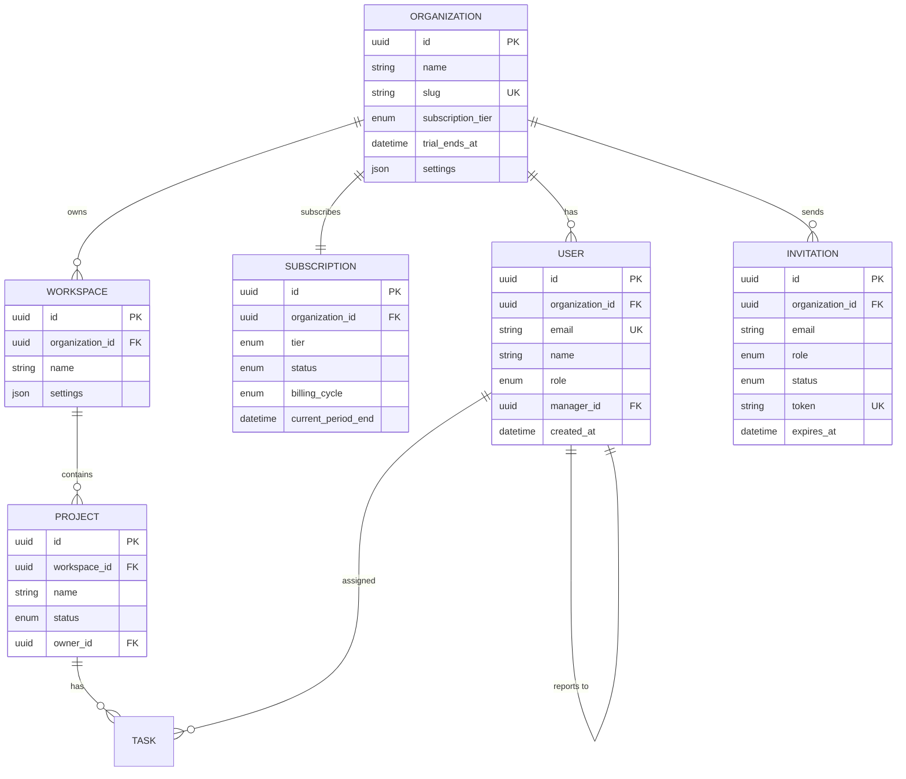

## Overview

This example demonstrates using Omni Architect for a B2B SaaS application with complex onboarding flows, role-based access control, and subscription management.

## Use Case

We're building a project management SaaS platform with:
- Multi-tenant architecture
- Team-based workspaces
- Subscription tiers (Free, Pro, Enterprise)
- Rich onboarding flow for new organizations

## The PRD

```markdown prd-saas.md
# PRD: Project Management SaaS Platform

## Feature: Organization Onboarding

### User Story
As a **team admin**, I want to **set up my organization workspace in under 5 minutes**,
so that my team can **start collaborating immediately**.

### Flow
1. Sign up with work email
2. Verify email
3. Create organization profile
4. Invite team members
5. Select subscription tier
6. Set up first project
7. Configure integrations (Slack, GitHub)

### Acceptance Criteria
- [ ] Email verification within 2 minutes
- [ ] Bulk team invite (up to 50 emails)
- [ ] Trial period: 14 days free Pro tier
- [ ] Integration setup optional but guided
- [ ] Progress saved at each step

### Entities
| Entity | Attributes |
|--------|------------|
| Organization | id, name, slug, subscription_tier, trial_ends_at |
| User | id, email, name, role, organization_id |
| Workspace | id, organization_id, name, settings |
| Project | id, workspace_id, name, status, owner_id |
| Invitation | id, email, organization_id, role, status, token |
| Subscription | id, organization_id, tier, status, billing_cycle |
```

## Running the Pipeline

<Steps>
  <Step title="Configure for SaaS workflow">
    Create `.omni-architect.yml` with SaaS-specific settings:
    
    ```yaml
    project_name: "Project Management SaaS"
    design_system: "tailwind"
    locale: "en-US"
    validation_mode: "batch"
    validation_threshold: 0.88
    
    diagram_types:
      - flowchart
      - sequence
      - erDiagram
      - stateDiagram
      - journey
    
    design_tokens:
      colors:
        primary: "#6366F1"
        secondary: "#8B5CF6"
        success: "#10B981"
        error: "#EF4444"
      typography:
        font_family: "Inter"
        heading_size: 28
        body_size: 16
    ```
  </Step>

  <Step title="Execute with journey mapping">
    ```bash
    skills run omni-architect \
      --prd_source "./docs/prd-saas.md" \
      --figma_file_key "xyz789ABC" \
      --figma_access_token "$FIGMA_TOKEN"
    ```
    
    The config file provides the rest of the settings.
  </Step>

  <Step title="Review in batch mode">
    All diagrams are presented together for approval:
    
    ```
    📊 5 diagrams generated:
    ✓ Onboarding Flowchart (score: 0.94)
    ✓ Signup Sequence (score: 0.91)
    ✓ Subscription State Machine (score: 0.89)
    ✓ Domain ER Diagram (score: 0.92)
    ✓ User Journey Map (score: 0.90)
    
    Overall score: 0.91 (threshold: 0.88) ✓
    
    [A]pprove all | [R]eject all | [S]elect individual?
    ```
  </Step>

  <Step title="Generate Figma assets">
    After approval, assets are created with Tailwind design system.
  </Step>
</Steps>

## Generated Diagrams

### Flowchart: Onboarding Flow



### State Diagram: Subscription States



### Journey Map: First-Time User



### Sequence Diagram: Team Invitation



### ER Diagram: Multi-Tenant Schema



## Validation Results

```json
{
  "overall_score": 0.91,
  "status": "approved",
  "breakdown": {
    "coverage": {
      "score": 0.94,
      "details": "All 7 onboarding steps represented"
    },
    "consistency": {
      "score": 0.91,
      "details": "Entities consistent across all diagrams"
    },
    "completeness": {
      "score": 0.88,
      "details": "Happy path, skip flows, and error handling covered"
    },
    "traceability": {
      "score": 0.92,
      "details": "All acceptance criteria mapped to flows"
    },
    "naming_coherence": {
      "score": 0.89,
      "details": "Consistent naming across diagrams"
    },
    "dependency_integrity": {
      "score": 0.95,
      "details": "Organization → User → Project hierarchy clear"
    }
  },
  "warnings": [
    "Consider adding C4 diagram for microservices architecture"
  ],
  "suggestions": [
    "Add payment processing sequence diagram",
    "Document integration webhooks in separate sequence"
  ]
}
```

## Figma Structure

```
📁 Project Management SaaS - Omni Architect
├── 📄 Index
├── 📄 User Flows
│   ├── 🖼️ Onboarding Flow (7 steps)
│   ├── 🖼️ Invitation Flow
│   └── 🖼️ Subscription Selection
├── 📄 State Machines
│   ├── 🖼️ Subscription Lifecycle
│   └── 🖼️ Project Status States
├── 📄 User Journeys
│   ├── 🖼️ Admin First-Time Experience
│   └── 🖼️ Team Member Onboarding
├── 📄 Interaction Specs
│   ├── 🖼️ Bulk Invitation Sequence
│   └── 🖼️ Email Verification Flow
├── 📄 Data Model
│   └── 🖼️ Multi-Tenant Schema
└── 📄 Component Library
    ├── 🧩 Tailwind Tokens
    ├── 🧩 Flow Connectors
    └── 🧩 State Indicators
```

## Key Learnings

<AccordionGroup>
  <Accordion title="Journey Maps for Complex Flows" icon="map">
    The `journey` diagram type is excellent for visualizing multi-step onboarding experiences and identifying friction points.
  </Accordion>
  
  <Accordion title="State Diagrams for Business Logic" icon="diagram-project">
    State diagrams clarify subscription lifecycle logic before implementing payment processing.
  </Accordion>
  
  <Accordion title="Batch Validation Mode" icon="list-check">
    For SaaS applications with multiple interconnected flows, `validation_mode: "batch"` lets you review the complete picture before approval.
  </Accordion>
  
  <Accordion title="Multi-Tenant ER Diagrams" icon="database">
    Clear entity relationships are critical for multi-tenant architectures. The ER diagram caught a missing `organization_id` FK early.
  </Accordion>
</AccordionGroup>

## Performance Metrics

| Metric | Value |
|--------|-------|
| **PRD Completeness** | 0.87 |
| **Diagrams Generated** | 5 |
| **Validation Score** | 0.91 |
| **Time to Figma** | 52 seconds |
| **Figma Assets Created** | 12 frames + component library |
| **Coverage** | 94% of features |

## Configuration Highlights

<CodeGroup>
```yaml .omni-architect.yml
project_name: "Project Management SaaS"
design_system: "tailwind"
locale: "en-US"
validation_mode: "batch"
validation_threshold: 0.88

diagram_types:
  - flowchart
  - sequence
  - erDiagram
  - stateDiagram
  - journey

design_tokens:
  colors:
    primary: "#6366F1"
    secondary: "#8B5CF6"
    success: "#10B981"
    error: "#EF4444"
  typography:
    font_family: "Inter"
    heading_size: 28
    body_size: 16
```

```bash CLI Command
skills run omni-architect \
  --prd_source "./docs/prd-saas.md" \
  --figma_file_key "xyz789ABC" \
  --figma_access_token "$FIGMA_TOKEN"
```
</CodeGroup>

<Tip>
For SaaS applications, include journey diagrams to visualize the complete user experience across multiple sessions.
</Tip>

## Next Steps

<CardGroup cols={2}>
  <Card title="Mobile App Example" icon="mobile" href="/examples/mobile-app">
    Learn about mobile-specific flows
  </Card>
  <Card title="Custom Workflows" icon="code-branch" href="/examples/custom-workflows">
    Add hooks for Slack notifications
  </Card>
  <Card title="Design Tokens" icon="palette" href="/configuration/design-tokens">
    Customize Tailwind tokens
  </Card>
  <Card title="State Diagrams" icon="diagram-project" href="/configuration/diagram-types">
    Deep dive on state machines
  </Card>
</CardGroup>