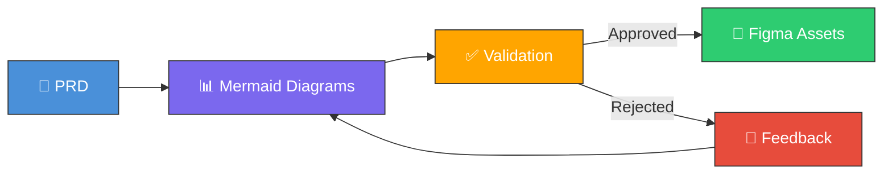

# Welcome to Omni Architect

Omni Architect is an orchestration framework that bridges the critical gap between Product Requirements Documents (PRDs) and visual design. It transforms written requirements into validated Mermaid diagrams and production-ready Figma assets through an intelligent multi-phase pipeline.

## The Problem

In product teams, there's a significant gap between PRD creation and design execution:

- **Retrabalho**: Designers misinterpret requirements leading to costly revisions
- **Inconsistências**: Product logic isn't validated before visual design begins
- **Lentidão**: The PRD → Design cycle takes days or weeks

## The Solution

Omni Architect eliminates this gap by inserting a **logical validation layer** between requirements and design:



**Result**: 70%+ reduction in design rework and guaranteed logic validation before investing in visual assets.

## Key Features

<CardGroup cols={2}>
  <Card title="Multi-Phase Pipeline" icon="sitemap" href="/concepts/pipeline-architecture">
    Orchestrates 5 phases from PRD parsing to Figma asset delivery
  </Card>
  <Card title="Automated Validation" icon="check-circle" href="/concepts/validation-scoring">
    6-criteria scoring system validates logic before design begins
  </Card>
  <Card title="8 Diagram Types" icon="diagram-project" href="/configuration/diagram-types">
    Flowchart, sequence, ER, class, state, C4, journey, and gantt diagrams
  </Card>
  <Card title="Design System Support" icon="palette" href="/configuration/design-systems">
    Material 3, Apple HIG, Tailwind, or custom design tokens
  </Card>
  <Card title="Extensible Architecture" icon="puzzle-piece" href="/concepts/skills-system">
    Sub-skill system allows custom pipeline phases
  </Card>
  <Card title="Flexible Validation" icon="sliders" href="/configuration/validation-modes">
    Interactive, batch, or auto validation modes
  </Card>
</CardGroup>

## How It Works

Omni Architect orchestrates five specialized skills in a sequential pipeline:

| Phase | Skill | Input | Output |
|-------|-------|-------|--------|
| **1. PRD Parser** | `prd-parse` | PRD Markdown | Semantic structure (features, stories, entities) |
| **2. Mermaid Generator** | `mermaid-gen` | Parsed PRD | Mermaid diagrams (flowchart, sequence, ER, etc.) |
| **3. Logic Validator** | `logic-validate` | Diagrams + PRD | Coherence score + validation report |
| **4. Figma Generator** | `figma-gen` | Validated diagrams | Figma assets (flows, specs, components) |
| **5. Asset Delivery** | `asset-deliver` | All artifacts | Consolidated delivery package |

## Quick Example

Transform a simple checkout flow PRD into validated diagrams and Figma assets:

<CodeGroup>

```markdown PRD Input
## Feature: Checkout Flow

### User Story
As a **buyer**, I want to **complete my purchase in 3 steps**,
so that I have a **fast, frictionless experience**.

### Acceptance Criteria
- [ ] User can select saved address or add new
- [ ] Real-time shipping calculation
- [ ] Support PIX, credit card, and boleto
- [ ] Automatic email confirmation
```

```bash CLI Command
skills run omni-architect \
  --prd_source "./checkout-prd.md" \
  --project_name "E-Commerce Platform" \
  --figma_file_key "abc123XYZ" \
  --figma_access_token "$FIGMA_TOKEN"
```

</CodeGroup>

**Output**: Validated Mermaid flowchart + sequence diagram + Figma design assets with 93% coherence score.

## Getting Started

<CardGroup cols={2}>
  <Card title="Quickstart" icon="rocket" href="/quickstart">
    Get up and running in 5 minutes
  </Card>
  <Card title="Installation" icon="download" href="/installation">
    Install via npm or clone the repository
  </Card>
  <Card title="Pipeline Architecture" icon="diagram-project" href="/concepts/pipeline-architecture">
    Understand the 5-phase orchestration system
  </Card>
  <Card title="Configuration Guide" icon="gear" href="/configuration/overview">
    Configure diagram types, design systems, and validation
  </Card>
</CardGroup>

## Community & Support

<CardGroup cols={2}>
  <Card title="GitHub Repository" icon="github" href="https://github.com/fabioeloi/omni-architect">
    Star the repo, report issues, contribute
  </Card>
  <Card title="Examples" icon="book-open" href="/examples/ecommerce-platform">
    Real-world examples and use cases
  </Card>
</CardGroup>

<Note>
  **MIT Licensed** — Omni Architect is open source and free to use for commercial and personal projects.
</Note>
