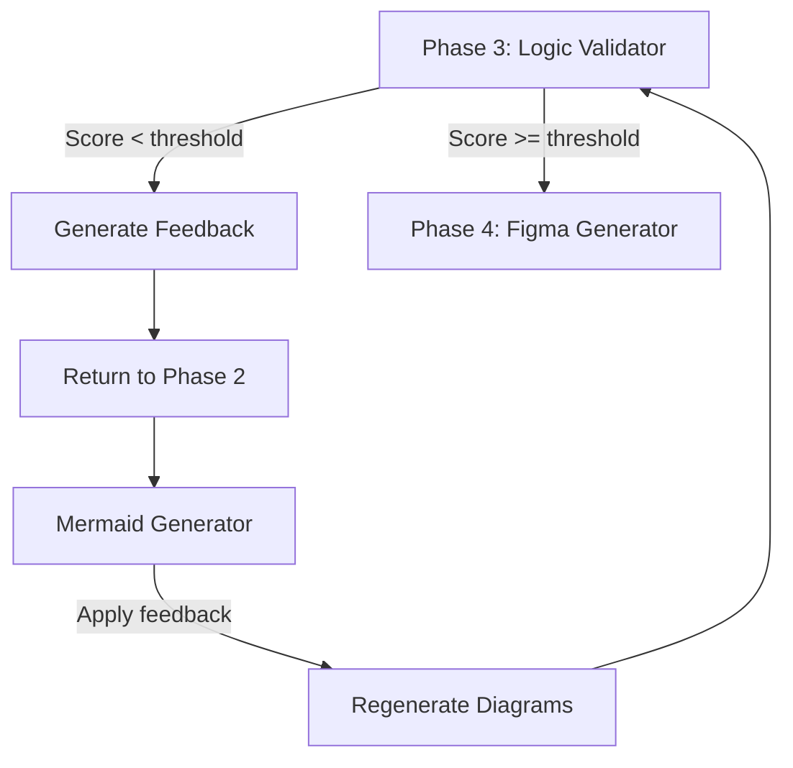

## Overview

The **Logic Validator** is Phase 3 of the Omni Architect pipeline. It analyzes the coherence of generated Mermaid diagrams against the original PRD using a weighted scoring system across six quality criteria, producing a detailed validation report.

<Info>
**Version**: 1.0.0  
**Author**: fabioeloi  
**Pipeline Phase**: 3 of 5
</Info>

## Purpose

Validation prevents the generation of Figma assets from inaccurate or incomplete diagrams. By establishing a quality gate with measurable criteria, it ensures that visual outputs accurately represent the product requirements before design investment begins.

## Inputs & Outputs

### Inputs

<ParamField path="parsed_prd" type="object" required>
  The structured PRD from Phase 1, used as the source of truth for validation.
</ParamField>

<ParamField path="diagrams" type="array" required>
  Array of generated Mermaid diagrams from Phase 2 to be validated.
</ParamField>

<ParamField path="validation_mode" type="string" default="interactive">
  Validation workflow mode:
  - `interactive`: Present each diagram + score, await approve/reject/modify per diagram
  - `batch`: Present all diagrams, await approve_all/reject_all/select
  - `auto`: Auto-approve if score >= threshold, otherwise reject
</ParamField>

<ParamField path="validation_threshold" type="number" default={0.85}>
  Minimum score (0.0 to 1.0) required for automatic approval when using `auto` mode.
</ParamField>

### Outputs

<ParamField path="validation_report" type="object">
  Comprehensive validation report containing:
  - **overall_score**: Weighted average score (0.0 - 1.0)
  - **status**: `approved`, `rejected`, or `pending`
  - **breakdown**: Per-criterion scores and details
  - **warnings**: List of detected issues
  - **suggestions**: Actionable improvement recommendations
</ParamField>

## Validation Criteria

The validator evaluates diagrams using six weighted criteria:

| Criterion | Weight | Verification Method |
|-----------|--------|---------------------|
| **Coverage** | 0.25 | Each feature/story must be represented in >= 1 diagram |
| **Consistency** | 0.25 | Same entity must have identical attributes across all diagrams |
| **Completeness** | 0.20 | Both happy path and sad path (error flows) must be present |
| **Traceability** | 0.15 | Every Mermaid node must be traceable to a PRD element ID |
| **Naming Coherence** | 0.10 | No conflicting aliases or naming variations |
| **Dependency Integrity** | 0.05 | Feature dependency order must be respected in flows |

### Score Calculation

```javascript
overall_score = Σ (criterion_score × criterion_weight) for each criterion

// Example calculation
overall_score = 
  (coverage_score * 0.25) +
  (consistency_score * 0.25) +
  (completeness_score * 0.20) +
  (traceability_score * 0.15) +
  (naming_coherence_score * 0.10) +
  (dependency_integrity_score * 0.05)
```

## Validation Modes

### Interactive Mode

<Steps>
  <Step title="Present Diagram">
    Display one diagram at a time with its individual validation score and breakdown.
  </Step>
  
  <Step title="Await Decision">
    Wait for user input: `approve`, `reject`, or `modify`.
  </Step>
  
  <Step title="Handle Modification">
    If user selects `modify`, capture specific feedback and return to Phase 2 (Mermaid Generator) with instructions.
  </Step>
  
  <Step title="Continue or Exit">
    Proceed to next diagram if approved, or exit validation if rejected.
  </Step>
</Steps>

**Best for**: Initial pipeline runs, complex PRDs requiring human judgment.

### Batch Mode

<Steps>
  <Step title="Display All Diagrams">
    Present all generated diagrams with a consolidated validation report.
  </Step>
  
  <Step title="Await Bulk Decision">
    Wait for user input: `approve_all`, `reject_all`, or `select` (choose specific diagrams).
  </Step>
  
  <Step title="Process Selection">
    If `select` is chosen, allow user to approve/reject individual diagrams from the batch.
  </Step>
</Steps>

**Best for**: Review sessions, stakeholder presentations.

### Auto Mode

```javascript
if (overall_score >= validation_threshold) {
  status = "approved";
  // Proceed to Phase 4 (Figma Generator)
} else {
  status = "rejected";
  // Generate detailed feedback
  // Return to Phase 2 with improvement suggestions
}
```

**Best for**: CI/CD pipelines, mature PRD processes with consistent quality.

## Criterion Details

### Coverage (25%)

Measures what percentage of PRD features and user stories are represented across all diagrams.

```javascript
coverage_score = (
  mapped_features_count / total_features_count +
  mapped_stories_count / total_stories_count
) / 2
```

**Pass threshold**: >= 0.85 (85% of elements represented)

**Example warning**: "Feature F003 'Payment Processing' not represented in any diagram."

### Consistency (25%)

Verifies that entities, attributes, and relationships are identical across all diagram types.

```javascript
for each entity in all_diagrams:
  for each attribute of entity:
    if attribute differs between diagrams:
      consistency_violations.push(entity, attribute)

consistency_score = 1.0 - (
  consistency_violations.length / total_cross_references
)
```

**Example warning**: "Entity 'Payment' uses attributes [id, amount, status] in ER diagram but [id, value, state] in sequence diagram."

### Completeness (20%)

Checks that both success paths (happy path) and failure paths (sad path) are documented in flow diagrams.

```javascript
for each flow in flowcharts:
  has_success_path = flow.includes('success') || flow.includes('confirmed')
  has_error_path = flow.includes('error') || flow.includes('failed')
  
  if (has_success_path && has_error_path):
    complete_flows++

completeness_score = complete_flows / total_flows
```

**Example warning**: "Flow 'Password Recovery' lacks error handling path."

### Traceability (15%)

Ensures every diagram node can be traced back to a specific PRD element (feature ID, story ID, entity name).

```javascript
for each node in all_diagrams:
  if (node.metadata.source_id exists in parsed_prd):
    traceable_nodes++

traceability_score = traceable_nodes / total_nodes
```

**Example warning**: "Node 'Process Refund' in flowchart not traceable to any PRD feature or story."

### Naming Coherence (10%)

Detects conflicting terminology and naming variations across diagrams.

```javascript
for each concept in all_diagrams:
  variations = find_naming_variations(concept)
  if (variations.length > 1):
    naming_conflicts.push(concept, variations)

naming_coherence_score = 1.0 - (
  naming_conflicts.length / total_concepts
)
```

**Example warning**: "Inconsistent terminology: 'Usuário' in flowchart vs 'User' in sequence diagram."

### Dependency Integrity (5%)

Validates that feature dependency order from the PRD is respected in flowcharts.

```javascript
for each feature_dependency in parsed_prd.dependencies:
  prerequisite_before_dependent = verify_order_in_flows(
    feature_dependency.prerequisite,
    feature_dependency.dependent
  )
  if (prerequisite_before_dependent):
    valid_dependencies++

dependency_integrity_score = valid_dependencies / total_dependencies
```

**Example warning**: "Feature F005 'Order History' appears before prerequisite F001 'User Authentication' in checkout flow."

## Example Validation Report

```json
{
  "overall_score": 0.91,
  "status": "approved",
  "timestamp": "2026-03-09T14:32:18Z",
  "breakdown": {
    "coverage": {
      "score": 0.95,
      "weight": 0.25,
      "weighted_score": 0.2375,
      "details": "19/20 features covered, 23/24 stories covered"
    },
    "consistency": {
      "score": 0.88,
      "weight": 0.25,
      "weighted_score": 0.22,
      "details": "Entidade 'Payment' diverge entre ER e Sequence"
    },
    "completeness": {
      "score": 0.90,
      "weight": 0.20,
      "weighted_score": 0.18,
      "details": "Falta sad path em 'Recuperar Senha'"
    },
    "traceability": {
      "score": 0.93,
      "weight": 0.15,
      "weighted_score": 0.1395,
      "details": "Todos rastreáveis exceto US018"
    },
    "naming_coherence": {
      "score": 0.92,
      "weight": 0.10,
      "weighted_score": 0.092,
      "details": "'Usuário' vs 'User' inconsistente"
    },
    "dependency_integrity": {
      "score": 0.98,
      "weight": 0.05,
      "weighted_score": 0.049,
      "details": "Todas as dependências respeitadas"
    }
  },
  "warnings": [
    "Entidade 'Payment' usa atributos diferentes no ER vs Sequence diagram",
    "User story US018 não possui representação visual",
    "Flow 'Recuperar Senha' não documenta caminho de erro"
  ],
  "suggestions": [
    "Padronizar nomenclatura para 'User' em todos os diagramas",
    "Adicionar fluxo de erro em 'Recuperar Senha'",
    "Mapear US018 no flowchart de autenticação",
    "Alinhar atributos de 'Payment' entre ER e Sequence diagrams"
  ]
}
```

## Usage in Pipeline

The Logic Validator is automatically invoked as Phase 3:

```bash
skills run omni-architect \
  --prd_source "./docs/requirements.md" \
  --validation_mode "interactive" \
  --validation_threshold 0.85
```

Approved diagrams proceed to [Phase 4: Figma Generator](/pipeline/figma-generator). Rejected diagrams return to Phase 2 with feedback.

## Score Interpretation

| Score Range | Status | Action |
|-------------|--------|--------|
| 0.90 - 1.0 | Excellent | Proceed to Figma generation |
| 0.85 - 0.89 | Good | Review warnings, proceed |
| 0.70 - 0.84 | Fair | Address major warnings before proceeding |
| 0.0 - 0.69 | Poor | Reject and regenerate diagrams |

## Feedback Loop

When validation fails or user requests modifications:



Feedback includes:
- Specific criterion that failed
- Detailed examples of violations
- Actionable suggestions for improvement
- Reference to original PRD sections

## Best Practices

<CardGroup cols={2}>
  <Card title="Start with Interactive Mode" icon="user">
    Use interactive validation on first run to understand quality patterns.
  </Card>
  
  <Card title="Calibrate Threshold" icon="sliders">
    Adjust validation_threshold based on team standards (0.80-0.90 typical).
  </Card>
  
  <Card title="Address Consistency First" icon="equals">
    Consistency issues cascade; fix entity/naming conflicts before other criteria.
  </Card>
  
  <Card title="Document Exceptions" icon="note">
    If intentionally deviating from PRD, document rationale in validation notes.
  </Card>
</CardGroup>

## Troubleshooting

| Issue | Cause | Solution |
|-------|-------|----------|
| "Low coverage score" | Diagrams missing features | Add flowcharts for uncovered features |
| "Consistency violations" | Entity definitions differ | Standardize entity attributes in PRD |
| "Traceability failures" | Missing metadata | Ensure Phase 2 includes PRD IDs in comments |
| "Auto-validation too strict" | Threshold too high | Lower validation_threshold to 0.80 |
| "All diagrams rejected" | PRD quality issues | Return to Phase 1 and improve PRD completeness |

## Next Phase

Once validation is approved, diagrams proceed to:

<Card title="Phase 4: Figma Generator" icon="figma" href="/pipeline/figma-generator">
  Generate design assets in Figma from validated Mermaid diagrams.
</Card>