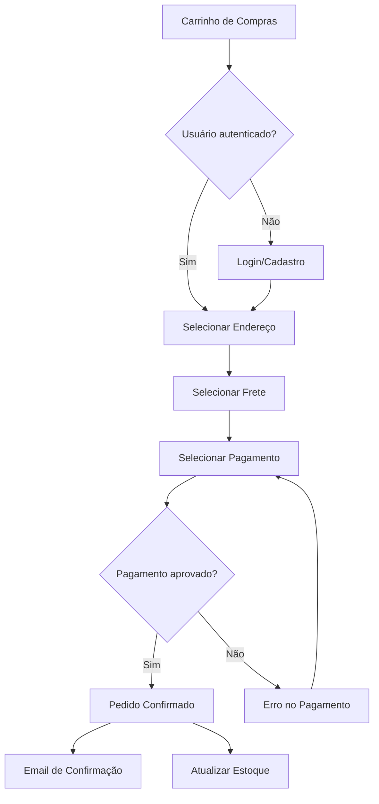
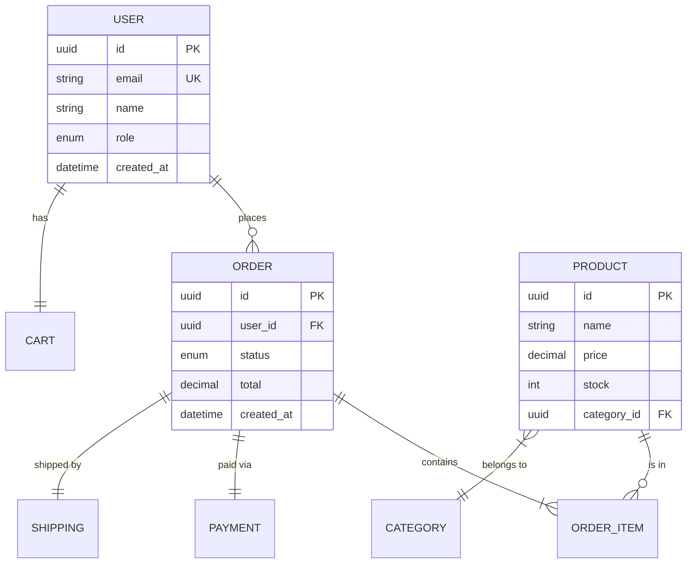
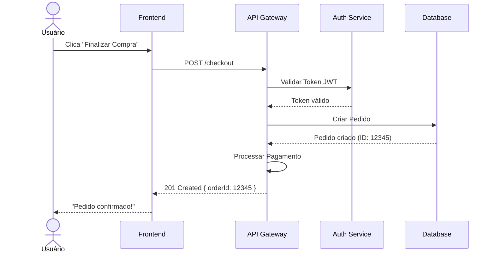
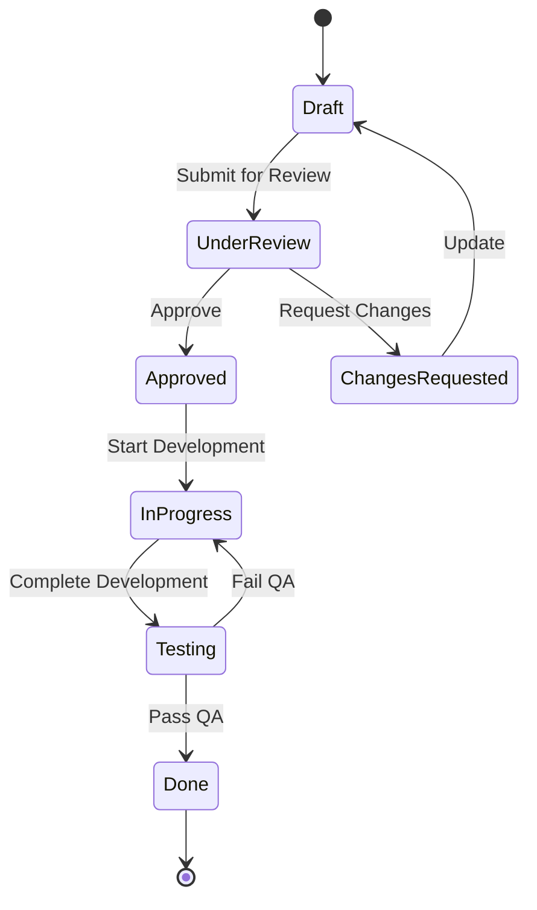
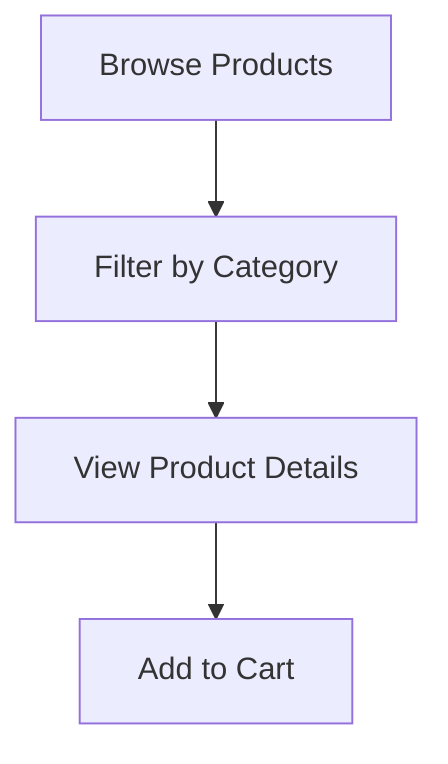

## Overview

The **Mermaid Generator** is Phase 2 of the Omni Architect pipeline. It transforms the structured PRD output from Phase 1 into rich, validated Mermaid diagrams including flowcharts, sequence diagrams, ER diagrams, state machines, and architectural views.

<Info>
**Version**: 1.0.0  
**Author**: fabioeloi  
**Pipeline Phase**: 2 of 5
</Info>

## Purpose

Automatic diagram generation bridges the gap between textual requirements and visual representation. By mapping PRD elements to appropriate diagram types, it creates a visual language for validating product logic before design begins.

## Inputs & Outputs

### Inputs

<ParamField path="parsed_prd" type="object" required>
  The structured PRD output from Phase 1 (PRD Parser) containing features, entities, flows, and relationships.
</ParamField>

<ParamField path="diagram_types" type="array" default='["flowchart", "sequence", "erDiagram"]'>
  Array of diagram types to generate. Supported values:
  - `flowchart`: Business flow visualization
  - `sequence`: Actor-system interactions
  - `erDiagram`: Data model and relationships
  - `stateDiagram`: State machines per feature
  - `C4Context`: High-level architecture
  - `journey`: User journey maps
  - `gantt`: Roadmap and dependencies
</ParamField>

<ParamField path="locale" type="string" default="pt-BR">
  Language for diagram labels and annotations. Supports pt-BR, en-US, es-ES, etc.
</ParamField>

### Outputs

<ParamField path="diagrams" type="array">
  Array of generated diagram objects, each containing:
  - **type**: Diagram type (flowchart, sequence, etc.)
  - **code**: Valid Mermaid syntax code
  - **coverage_pct**: Percentage of PRD elements covered
  - **source_features**: Array of feature IDs represented in this diagram
</ParamField>

## PRD Element Mapping

The generator intelligently maps PRD components to optimal diagram types:

| PRD Element | Mermaid Type | Condition | Purpose |
|-------------|--------------|-----------|----------|
| `flows` | `flowchart TD` | When business flows exist | Visualize process steps and decision points |
| `user_stories` + `entities` | `sequenceDiagram` | When actor-system interactions present | Show message flow between actors |
| `entities` + `relationships` | `erDiagram` | When >= 2 entities defined | Document data model structure |
| `features` with states | `stateDiagram-v2` | When features have lifecycle states | Illustrate state transitions |
| `system_overview` | `C4Context` | When external systems mentioned | Provide architectural context |
| `personas` + `journeys` | `journey` | When personas are defined | Map user experience touchpoints |
| `dependencies` + `timeline` | `gantt` | When roadmap information present | Show timeline and dependencies |

## Generation Rules

<Steps>
  <Step title="Select Relevant Elements">
    For each requested diagram type, filter the parsed PRD for relevant elements (e.g., flows for flowcharts, entities for ER diagrams).
  </Step>
  
  <Step title="Apply Mermaid Template">
    Use diagram-specific templates to structure the Mermaid syntax with appropriate headers and formatting.
  </Step>
  
  <Step title="Resolve Cross-References">
    Link related entities across diagrams using consistent identifiers (e.g., User entity appears identically in ER and sequence diagrams).
  </Step>
  
  <Step title="Localize Labels">
    Translate all labels, annotations, and text elements to the configured locale language.
  </Step>
  
  <Step title="Validate Syntax">
    Run parser check to ensure generated Mermaid code is syntactically valid before proceeding.
  </Step>
  
  <Step title="Calculate Coverage">
    Compute percentage of PRD features/stories represented in each diagram.
  </Step>
  
  <Step title="Attach Metadata">
    Add traceability comments linking diagram nodes back to PRD feature IDs.
  </Step>
</Steps>

### Automatic Splitting

- **Constraint**: Maximum 50 nodes per diagram
- **Action**: If exceeded, automatically split into sub-diagrams
- **Index**: Create an index diagram with navigation links

## Example Generations

### Flowchart from Business Flow

Given a checkout flow in the PRD, the generator produces:



### ER Diagram from Domain Entities

Given entity definitions with relationships:



### Sequence Diagram from User Stories

Given user stories with actor interactions:



### State Diagram from Feature Lifecycle

Given features with state transitions:



## Validation & Quality

### Syntax Validation

Every generated diagram undergoes automatic syntax validation:

```javascript
// Pseudo-code for validation
function validateMermaid(code) {
  try {
    mermaid.parse(code);
    return { valid: true };
  } catch (error) {
    return { 
      valid: false, 
      error: error.message,
      line: error.line 
    };
  }
}
```

### Coverage Calculation

```javascript
coverage_pct = (
  elements_represented_in_diagram / total_prd_elements
) * 100;
```

Diagrams with less than 70% coverage trigger warnings suggesting additional detail.

## Traceability

Generated diagrams include metadata comments for traceability:



This enables Phase 3 (Logic Validator) to verify diagram-PRD alignment.

## Configuration Options

### Locale Support

Labels are automatically translated based on the `locale` parameter:

| Element | pt-BR | en-US | es-ES |
|---------|-------|-------|-------|
| User | Usuário | User | Usuario |
| Payment | Pagamento | Payment | Pago |
| Confirmed | Confirmado | Confirmed | Confirmado |
| Error | Erro | Error | Error |

### Custom Diagram Types

You can request specific diagram combinations:

```bash
skills run omni-architect \
  --diagram_types '["flowchart","sequence","erDiagram","C4Context"]'
```

## Usage in Pipeline

The Mermaid Generator is automatically invoked as Phase 2:

```bash
skills run omni-architect \
  --prd_source "./docs/requirements.md" \
  --diagram_types '["flowchart","sequence","erDiagram"]' \
  --locale "en-US"
```

Generated diagrams are passed to [Phase 3: Logic Validator](/pipeline/logic-validator) for coherence validation.

## Best Practices

<CardGroup cols={2}>
  <Card title="Start with Core Diagrams" icon="circle-check">
    Begin with flowchart, sequence, and erDiagram for maximum value.
  </Card>
  
  <Card title="Match Diagram to Purpose" icon="bullseye">
    Use flowcharts for processes, sequences for interactions, ER for data.
  </Card>
  
  <Card title="Keep Flows Focused" icon="filter">
    Split complex flows into multiple diagrams for clarity.
  </Card>
  
  <Card title="Maintain Consistency" icon="equals">
    Ensure entity names match exactly across all diagram types.
  </Card>
</CardGroup>

## Troubleshooting

| Issue | Cause | Solution |
|-------|-------|----------|
| "Syntax error in flowchart" | Special characters in PRD | Escape quotes and brackets in text |
| "No diagrams generated" | PRD lacks structured elements | Add flows, entities, or stories to PRD |
| "Coverage too low" | Minimal PRD detail | Expand PRD with more features/stories |
| "Duplicate entity definitions" | Inconsistent naming in PRD | Standardize entity names in PRD |

## Next Phase

Once diagrams are generated, they proceed to:

<Card title="Phase 3: Logic Validator" icon="shield-check" href="/pipeline/logic-validator">
  Validate diagram coherence against the original PRD using weighted scoring criteria.
</Card>