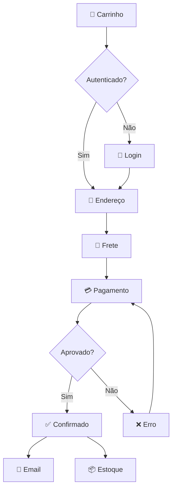

Get your first PRD transformed into validated Mermaid diagrams and Figma assets in under 5 minutes.

## Prerequisites

Before you begin, ensure you have:

- Node.js 18 or higher
- A Figma account with a file you can edit
- A Figma access token ([get one here](https://www.figma.com/developers/api#access-tokens))

## Installation

<CodeGroup>

```bash npm
npx skills add https://github.com/fabioeloi/omni-architect --skill omni-architect
```

```bash yarn
yarn dlx skills add https://github.com/fabioeloi/omni-architect --skill omni-architect
```

```bash pnpm
pnpm dlx skills add https://github.com/fabioeloi/omni-architect --skill omni-architect
```

</CodeGroup>

## Quick Example: E-Commerce Checkout Flow

Let's transform a checkout flow PRD into validated diagrams and Figma assets.

<Steps>

<Step title="Create a PRD file">

Create a file called `checkout-prd.md` with your product requirements:

```markdown
## Feature: Checkout Flow

### User Story
Como **comprador**, quero **finalizar minha compra em até 3 passos**,
para que eu tenha uma **experiência rápida e sem fricção**.

### Acceptance Criteria
- [ ] Usuário pode selecionar endereço salvo ou cadastrar novo
- [ ] Cálculo de frete em tempo real
- [ ] Suporte a PIX, cartão e boleto
- [ ] Confirmação por email automática
```

</Step>

<Step title="Set your Figma token">

Export your Figma access token as an environment variable:

```bash
export FIGMA_TOKEN="your-figma-token-here"
```

</Step>

<Step title="Run Omni Architect">

Execute the skill with your PRD:

```bash
skills run omni-architect \
  --prd_source "./checkout-prd.md" \
  --project_name "E-Commerce Platform" \
  --figma_file_key "YOUR_FIGMA_FILE_KEY" \
  --figma_access_token "$FIGMA_TOKEN"
```

<Note>
Find your Figma file key in the URL: `https://www.figma.com/file/<FILE_KEY>/...`
</Note>

</Step>

<Step title="Review the output">

Omni Architect generates:

- **Flowchart diagram** showing the checkout process
- **Sequence diagram** for user-system interactions
- **ER diagram** for data model
- **Validation report** with coherence score
- **Figma assets** organized in your file

Expected output structure:



</Step>

<Step title="Check your Figma file">

Open your Figma file to see the generated assets:

```
📁 E-Commerce Platform - Omni Architect
├── 📄 Index
├── 📄 User Flows
│   └── 🖼️ Checkout Flow
├── 📄 Interaction Specs
│   └── 🖼️ Checkout Sequence
├── 📄 Data Model
└── 📄 Component Library
```

</Step>

</Steps>

## Understanding the Validation Report

Omni Architect validates your diagrams before generating Figma assets. Here's a sample report:

```json
{
  "overall_score": 0.93,
  "status": "approved",
  "breakdown": {
    "coverage": { "score": 0.95, "weight": 0.25 },
    "consistency": { "score": 0.92, "weight": 0.25 },
    "completeness": { "score": 0.90, "weight": 0.20 },
    "traceability": { "score": 0.95, "weight": 0.15 },
    "naming_coherence": { "score": 0.90, "weight": 0.10 },
    "dependency_integrity": { "score": 1.00, "weight": 0.05 }
  }
}
```

<Note>
The default validation threshold is **0.85**. Diagrams scoring above this threshold are automatically approved.
</Note>

## Next Steps

<CardGroup cols={2}>

<Card title="Configuration" icon="gear" href="/configuration/overview">
  Customize diagram types, design systems, and validation modes
</Card>

<Card title="Pipeline Phases" icon="sitemap" href="/pipeline/prd-parser">
  Explore all pipeline phases in detail
</Card>

<Card title="Validation" icon="check-circle" href="/concepts/validation-scoring">
  Learn how validation scoring works
</Card>

<Card title="Examples" icon="code" href="/examples/ecommerce-platform">
  See more complex PRD examples
</Card>

</CardGroup>

## Common Issues

<AccordionGroup>

<Accordion title="Invalid Figma token">
If you see a `403` error, verify:
- Your token is valid and not expired
- You have edit permissions on the Figma file
- The token is correctly exported to `$FIGMA_TOKEN`
</Accordion>

<Accordion title="Low coverage score">
If your validation score is below 0.85:
- Add more details to your PRD user stories
- Include acceptance criteria for each feature
- Define clear flows and dependencies
</Accordion>

<Accordion title="PRD parsing failed">
Ensure your PRD:
- Uses Markdown format with proper headings
- Has structured sections (Feature, User Story, Acceptance Criteria)
- Doesn't contain special characters that break parsing
</Accordion>

</AccordionGroup>