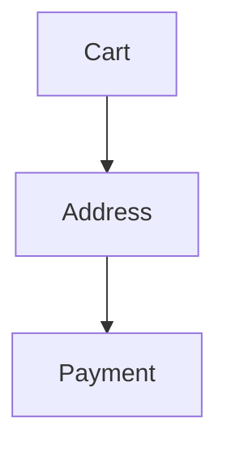
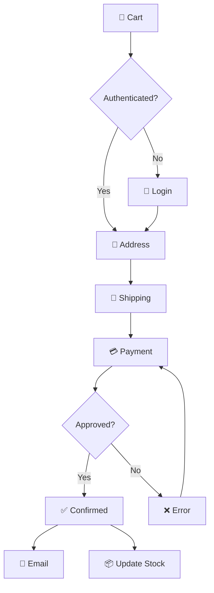
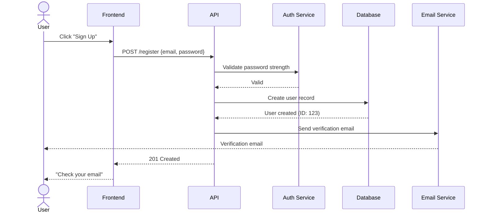
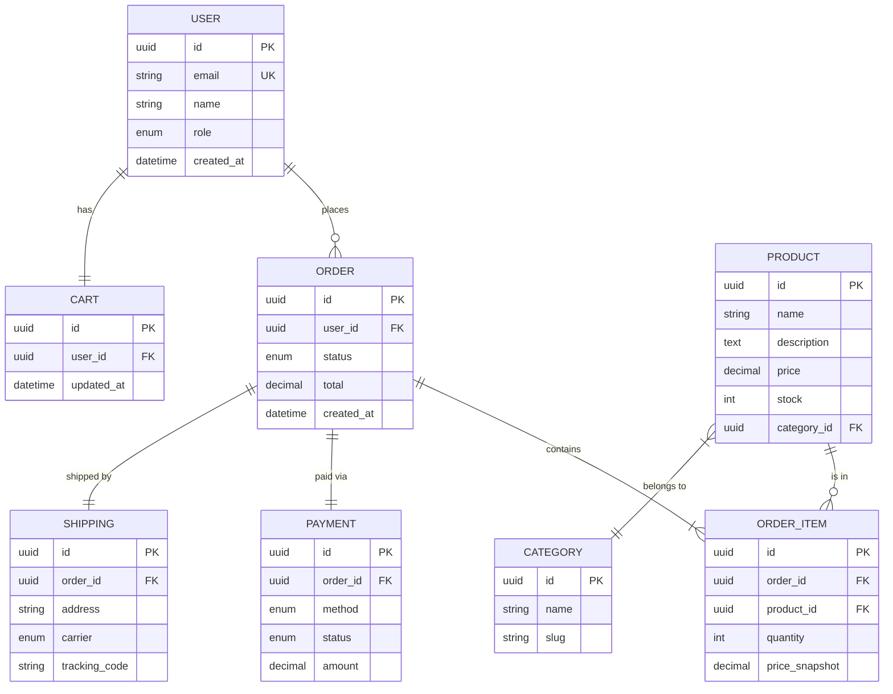
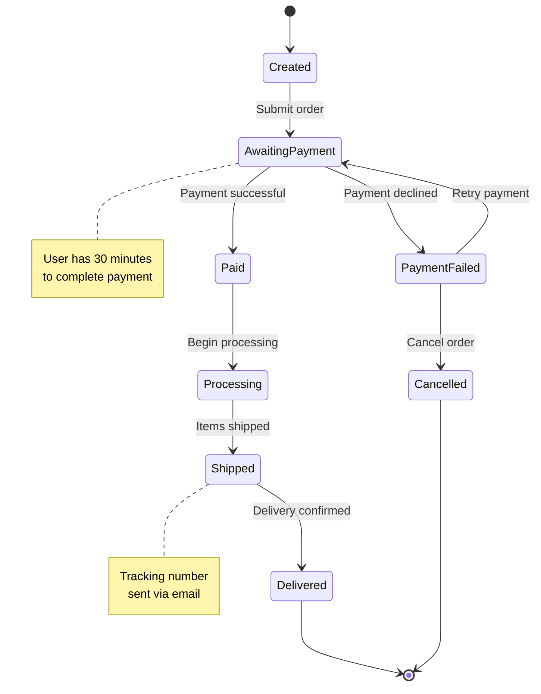

# Mermaid Generator

The **Mermaid Generator** is Phase 2 of the Omni Architect pipeline. It automatically generates multiple types of Mermaid diagrams from the parsed PRD structure, creating visual representations of product logic, data models, user interactions, and system architecture.

## Purpose

Transforms structured PRD data into executable Mermaid diagram code that visualizes:

- **Business Flows** as flowcharts
- **User Interactions** as sequence diagrams
- **Data Models** as entity-relationship diagrams
- **Feature States** as state diagrams
- **System Architecture** as C4 Context diagrams
- **User Journeys** as journey maps
- **Project Timelines** as Gantt charts

These diagrams serve as an intermediate validation layer before investing in high-fidelity Figma designs.

## Inputs

<ParamField path="parsed_prd" type="object" required>
  The structured PRD output from the PRD Parser (Phase 1). Must contain features, entities, flows, and user stories.
</ParamField>

<ParamField path="diagram_types" type="array" default='["flowchart", "sequence", "erDiagram"]'>
  Array of diagram types to generate. Supported values:
  - `flowchart` - Business process flows
  - `sequence` - Actor-system interaction sequences
  - `erDiagram` - Entity-relationship data models
  - `stateDiagram` - State machines for features
  - `C4Context` - System context architecture
  - `journey` - User journey maps
  - `gantt` - Project timelines
</ParamField>

<ParamField path="locale" type="string" default="pt-BR">
  Language for diagram labels and annotations. Supports `pt-BR`, `en-US`, `es-ES`, etc.
</ParamField>

## Outputs

<ResponseField name="diagrams" type="array">
  Array of generated diagram objects, each containing:
  
  **Structure:**
  ```json
  [
    {
      "type": "flowchart|sequence|erDiagram|stateDiagram|C4Context|journey|gantt",
      "code": "string (Mermaid syntax)",
      "coverage_pct": "number (0-100)",
      "source_features": ["F001", "F002"],
      "metadata": {
        "node_count": "number",
        "created_at": "ISO timestamp",
        "syntax_valid": "boolean"
      }
    }
  ]
  ```
</ResponseField>

## Diagram Type Mappings

The generator automatically selects appropriate diagram types based on PRD content:

| PRD Element | Mermaid Type | Condition |
|-------------|--------------|-----------||
| `flows` | `flowchart TD` | Always generated when flows exist |
| `user_stories` + `entities` | `sequenceDiagram` | When actor-system interactions are present |
| `entities` + `relationships` | `erDiagram` | When >= 2 entities with relationships exist |
| `features` with lifecycle states | `stateDiagram-v2` | When features have state transitions |
| `system_overview` | `C4Context` | When PRD mentions external systems |
| `personas` + `journeys` | `journey` | When user personas are defined |
| `dependencies` + `timeline` | `gantt` | When feature timeline is specified |

## Generation Rules

### 1. Syntax Validation
All generated Mermaid code is validated using a parser check before output. Invalid syntax triggers automatic correction with up to 3 retry attempts.

### 2. Localization
Labels, annotations, and node names are automatically translated to the configured `locale`:

```mermaid
// locale: pt-BR
flowchart TD
    A[Início] --> B{Autenticado?}
    B -->|Sim| C[Dashboard]
    B -->|Não| D[Login]
```

### 3. Node Limits
Diagrams are limited to 50 nodes maximum. If a flow exceeds this limit, it's automatically split into sub-diagrams with an index diagram for navigation.

### 4. Traceability Comments
Feature and story IDs are embedded as comments for traceability:



### 5. Coverage Calculation
Each diagram includes a `coverage_pct` indicating what percentage of PRD elements are represented:

```
coverage_pct = (represented_elements / total_elements) × 100
```

## Example Outputs

### Flowchart: Checkout Process



**Metadata:**
```json
{
  "type": "flowchart",
  "coverage_pct": 95,
  "source_features": ["F002"],
  "node_count": 11
}
```

### Sequence Diagram: User Registration



**Metadata:**
```json
{
  "type": "sequence",
  "coverage_pct": 100,
  "source_features": ["F001"],
  "node_count": 6
}
```

### ER Diagram: E-Commerce Domain



**Metadata:**
```json
{
  "type": "erDiagram",
  "coverage_pct": 90,
  "source_features": ["F001", "F002", "F003"],
  "node_count": 8
}
```

### State Diagram: Order Lifecycle



**Metadata:**
```json
{
  "type": "stateDiagram",
  "coverage_pct": 100,
  "source_features": ["F002"],
  "node_count": 9
}
```

## Best Practices

### Provide Complete PRD Data
The quality of generated diagrams depends on PRD completeness. Ensure your PRD includes:
- Clear flow descriptions with steps
- Well-defined entities with attributes
- User stories with actors and actions
- Feature dependencies and states

### Request Multiple Diagram Types
Different diagrams reveal different aspects of your product:
```bash
--diagram_types '["flowchart","sequence","erDiagram","stateDiagram"]'
```

### Review Coverage Percentages
Low coverage indicates missing diagram types or incomplete PRD sections. Aim for >85% coverage.

### Use Diagrams for Validation
These diagrams are meant for logic validation before design. Share with stakeholders to catch gaps early.

## Error Handling

| Scenario | Behavior |
|----------|----------|
| Invalid Mermaid syntax | Auto-correction with up to 3 retries, then warning |
| PRD missing required sections | Skips affected diagram types, generates what's possible |
| Diagram exceeds 50 nodes | Auto-splits into sub-diagrams with index |
| Unsupported diagram type | Warning logged, type skipped |
| Entity relationship cycles | Detected and resolved with proper edge directions |

## Integration

The Mermaid Generator runs automatically in Phase 2 of the Omni Architect pipeline:

```bash
skills run omni-architect \
  --prd_source "./docs/my-prd.md" \
  --diagram_types '["flowchart","sequence","erDiagram"]' \
  --locale "pt-BR" \
  --project_name "My Project" \
  --figma_file_key "abc123" \
  --figma_access_token "$FIGMA_TOKEN"
```

Generated diagrams flow into the Logic Validator (Phase 3) for coherence analysis.